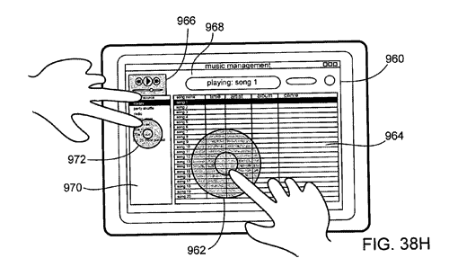

# 传言:台湾胜华科技将供应 iPod 触摸屏

> 原文：<https://web.archive.org/web/http://techcrunch.com/2007/07/11/rumor-taiwans-wintek-to-supply-ipod-touchscreens/>

尽管拒绝发表评论，但台湾电子产品制造商胜华科技据称已被选中为仍在传言中的今年秋季上市的新款视频 iPods 提供触摸屏。

这些信息来自 Wintek 供应链上的消息来源，Wintek 以客户保密为由对此事不予置评，这可能是一个好的迹象，表明这是真的。

Wintek 以使用一种被称为“膜上芯片”的技术而闻名，这是一种安装有组件的柔性薄膜，常用于手机等小屏幕设备。这种薄膜可以在不包含任何组件的地方折叠(如角落)，如果苹果将屏幕扩展到这款尚未正式宣布的设备的整个正面，这将是一个不错的选择。

[胜华科技为新的苹果 iPods 配备触摸屏面板](https://web.archive.org/web/20141016163731/http://www.digitimes.com/displays/a20070710PD217.html)【电子时报】