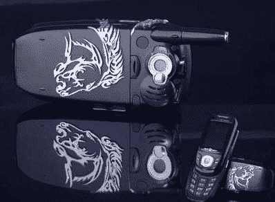

# 俄罗斯推出一款镶嵌宝石的 Ubiquam U300 手机

> 原文：<https://web.archive.org/web/http://techcrunch.com/2007/01/31/russia-busts-out-a-gem-infused-ubiquam-u300-phone/>

# 俄罗斯推出一款镶嵌宝石的 Ubiquam U300 手机

你好。我叫维克多。我帮助后期制作，对吗？

我的祖国俄罗斯有非常好的手机。最佳供应商 SkyLink 已与 Almaz Holding 达成协议，设计令人惊叹的手机。这两个人拿了一个 Ubiquam U300 手机(它有 CDMA 和 EV-DO 功能，没有酷刑),啊，你怎么说呢，用 7.2 克的银加上一幅野马的银画。然后他们加上 29 颗 0.01 克拉的宝石，你就大功告成了。

只有一个存在，不出售！它将在美丽的俄罗斯周围的博览会上展示，所以请不要像前苏联那样抱有希望。

[镶有 29 颗宝石的银色野马手机](https://web.archive.org/web/20130628185739/http://www.unwiredview.com/2007/01/31/skylink-ubiquam-u300-silver-mustang-phone-with-29-gems/)