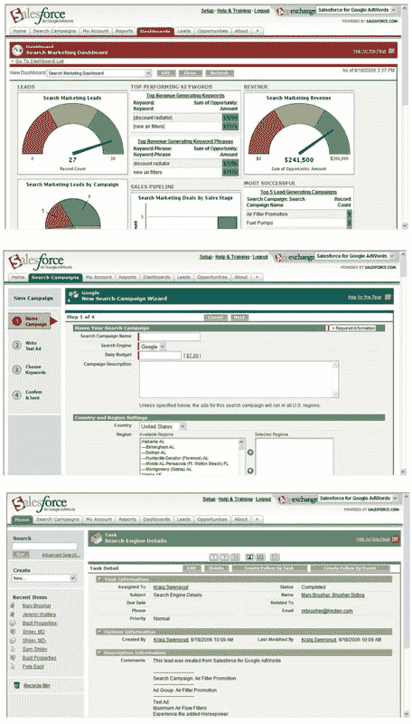

# Salesforce 深入研究 Google Adwords TechCrunch

> 原文：<https://web.archive.org/web/http://www.techcrunch.com:80/2006/08/21/salesforce-dives-deep-into-google-adwords/>

# Salesforce 深入研究 Google Adwords

T2 sales force 将于周二宣布推出一项名为 Salesforce for Google Adwords 的新服务。新产品将在今年早些时候[推出的](https://web.archive.org/web/20221204143002/http://www.beta.techcrunch.com/2006/03/06/salesforce-announces-new-developer-community-and-business-mashups/) [AppExchange](https://web.archive.org/web/20221204143002/http://www.appexchange.com/) 向 Salesforce 客户提供。谷歌 AdWords 的 Salesforce 可以在[appexchange.com](https://web.archive.org/web/20221204143002/http://www.appexchange.com/)的营销类别的搜索营销下找到。

客户可以使用该产品来创建、跟踪和衡量 Google Adwords 购买情况，包括每个关键词的关键投资回报率计算。Salesforce 客户可以免费试用该应用程序 30 天；之后费用是 300 美元/月。

该产品打入了近 60 亿美元的搜索引擎营销市场(预计到 2010 年将增长到 110 亿美元)。(来源:sempo.org)显然是没有有效工具的中小型企业所需要的，以便在搜索引擎上轻松创建和跟踪关键词购买。至于 Salesforce for Adwords 是否允许客户跟踪 Overture 和其他竞争平台上的类似广告支出，目前还没有消息。

Salesforce for Adwords 背后的技术来自于本月早些时候被 Salesforce 收购的 Kieden Corporation。自今年 5 月以来，Appexchange 上已提供基本应用程序。看来 Salesforce 非常喜欢它，他们买下了这家公司。

许多人将 AppExchange 称为“[企业 2.0](https://web.archive.org/web/20221204143002/http://blogs.zdnet.com/BTL/?p=3527) ”的一个重要例子。不管它叫什么，它肯定是一个非常成功的平台:来自 200 家公司的 300 多个应用程序可用，客户已经安装了这些应用程序超过 12000 次。

由 Salesforce 提供的屏幕截图如下:

