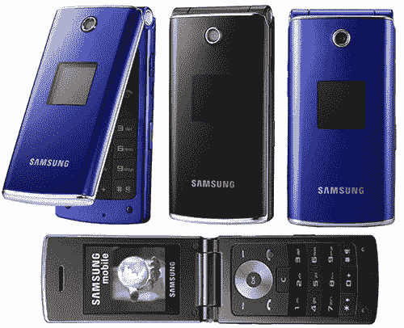

# 三星 E210 看起来很漂亮| TechCrunch

> 原文：<https://web.archive.org/web/http://techcrunch.com/2007/05/25/samsung-e210-looks-pretty/>

作为三星 Ultra Edition II 系列的一部分，三星 E210 是一款非常漂亮的翻盖手机，有点像摩托罗拉 KRZR。但外表可能会欺骗我的朋友，因为 E210 是三星的基本入门级手机。仔细观察，你会发现三频 GSM、microSD、130 万像素摄像头、蓝牙 2.0、USB 和 65k 彩色有机发光二极管屏幕。对我来说，作为一款入门级手机，听起来还不错。此外，它的设计似乎很薄，这对于口袋来说总是一种享受。

预计零售价在 200 美元左右。目前还不知道发布日期，也不知道它是否会在美国上市，不过多亏了三频 GSM，它肯定会上市。

[三星 E210——轻薄实惠的翻盖](https://web.archive.org/web/20151001040104/http://www.unwiredview.com/2007/05/25/samsung-e210-thin-and-affordable-clamshell/)