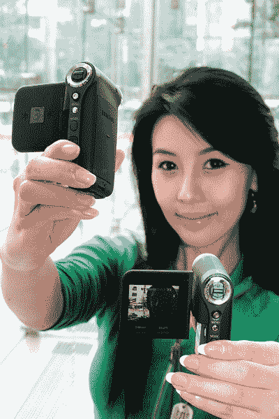

# 三星狗仔队摄像机，VM-X300 

> 原文：<https://web.archive.org/web/http://techcrunch.com/2007/06/07/samsung-paparazzi-camcorder-vm-x300/>

在大多数情况下，我不会吹嘘三秒钟内下车或上车，但三星对此并不感到羞耻或害羞，我也不怪他们。VM-X300 是三星最新的摄像机，我脑子里的想法完全是非法的。各位，我相信你们能想到很多三秒钟开关摄像机的情况，对吗？不管怎样，视频是以 Mpeg4 ASP(高级简单模式)录制的，分辨率为 720×480，每秒 30 帧。我喜欢。

[三星新摄像机 VM-X300](https://web.archive.org/web/20150923012240/http://akihabaranews.com/en/news-14047-New+camcorder+by+Samsung%2C+the+VM-X300.html) 【秋叶原新闻】