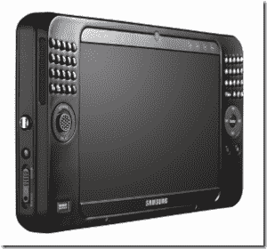

# 三星 Q1 超 UMPC:嗯。好的。TechCrunch

> 原文：<https://web.archive.org/web/http://techcrunch.com/2007/05/07/samsung-q1-ultra-umpc-huh-ok/>

又一天，又一个 UMPC。三星 Q1 是自两年前切片面包以来最热门的东西，但现在他们已经发布了超级 Ultra 版本，我很确定我们都有点打哈欠了。我的意思是他们甚至不叫它 Q1。他们只是在那里贴了一个超然后就收工了。

它有一个分离式 QWERTY 键盘、拇指按钮和 799 美元的价格标签，所以如果你想买镇纸，你知道去哪里找。

[三星推出 Q1 Ultra，这是超移动个人计算发展的下一个阶段](https://web.archive.org/web/20151001015725/http://home.businesswire.com/portal/site/google/index.jsp?ndmViewId=news_view&newsId=20070507005555&newsLang=en)【通过 [GottaBeMobile](https://web.archive.org/web/20151001015725/http://www.gottabemobile.com/SamsungQ1UltraUMPCSpecsAndPricing.aspx) 发布】