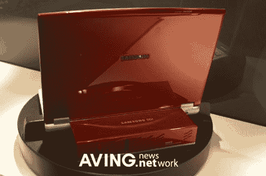

# 三星在韩国展示新型燃料电池

> 原文：<https://web.archive.org/web/http://techcrunch.com/2007/08/13/samsung-shows-off-new-fuel-cell-in-korea/>

三星最近在韩国展示了其新型便携式燃料电池电源。增强的电池显然可以让你从笔记本电脑中挤出一个月的电量。

燃料电池消耗一种叫做反应物的化学物质，这种化学物质必须被补充，不像传统电池消耗储存的电能。没有消息说三星的新产品是否或何时会向公众开放，更重要的是，价格是多少。

更多照片和视频请点击以下链接:

[三星 SDI 的燃料电池运行一个月【Aving.net ](https://web.archive.org/web/20151002022556/http://aving.net/usa/news/default.asp?mode=read&c_num=55071&C_Code=07&SP_Num=0)