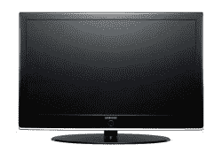

# 三星超级电视

> 原文：<https://web.archive.org/web/http://techcrunch.com/2007/05/03/samsung-super-tvs/>

# 三星超级电视

Samung 的新电视系列尺寸从 37 英寸到 52 英寸不等，可以以全分辨率播放 1080p 视频，这曾经是只有 DLP 才能实现的壮举，至少价格是人类可以理解的。这些电视，M87，R87 和 Q97 将会是大约 3000 美元，如果他们到达这些海岸的话。

也就是说，它目前只在英国发售，而且刚刚开始发货，所以如果你想买一个的话，就上不定期轮船吧。

[三星发布终极高清电视](https://web.archive.org/web/20130628204809/http://www.t3.co.uk/news/247/entertainment/tv_-_lcd/samsung_unveils_ultimate_hdtvs?cid=OTC-RSS&attr=T3-Standard-RSS)【