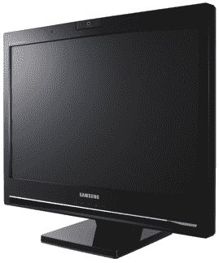

# 三星 SyncMaster 225UW 显示器

> 原文：<https://web.archive.org/web/http://techcrunch.com/2007/05/15/samsung-syncmaster-225uw-monitor/>

# 三星 SyncMaster 225UW 显示器

三星推出的 SyncMaster 225UW 液晶显示器满足了您的所有显示器需求。22 英寸宽屏显示器内置 200 万像素网络摄像头、立体声扬声器和麦克风。到目前为止还不错，对吧？1650×1050 分辨率，700:1 对比度，5ms 响应时间怎么样？听起来好一点。最新的 SyncMaster 将是市场上第一个能够与微软的 Office Communicator 2007 IM/VoIP/PBX 通信套件接口的官方产品。所有这些都意味着你可以将 225UW 作为你的桌面电话使用。你梦想中的显示器将于下个月降价 449 美元。

[新闻稿](https://web.archive.org/web/20201129124214/http://home.businesswire.com/portal/site/home/index.jsp?ndmViewId=news_view&ndmConfigId=1000001&newsId=20070515005529&newsLang=en)