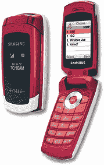

# 三星 T219 在 T-Mo 发布——TechCrunch

> 原文：<https://web.archive.org/web/http://techcrunch.com/2007/02/26/samsung-t219-launches-on-t-mo/>

# 三星 T219 在 T-Mo 发布

不是每个人都需要一部功能丰富的手机来满足他们的生活需求。三星 SGH-T219 似乎正是迎合了这一人群，只包含一部可用手机所需的必需品。除了漂亮的糖果红色，这款手机还有 64k 液晶内部显示屏，灰度外部显示屏，即时消息，并支持短信。没错。就是这样。如果你有足够多的朋友，它也可以和 T-Mobile 的 myFaves 服务一起使用。

哦，是的，它也有棕色的，如果你喜欢那种东西的话。