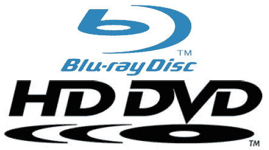

# 三星的蓝光和 HD DVD 兼容双高清播放器在这里的假期 

> 原文：<https://web.archive.org/web/http://techcrunch.com/2007/04/13/samsungs-blu-ray-and-hd-dvd-compatible-duo-hd-player-here-by-the-holidays/>

# 三星的蓝光和 HD DVD 兼容双高清播放器在这里的假期

三星将在假期前发布蓝光和 HD DVD 双高清播放器(BD-UP5000)。与 LG 的[超级超级快乐无论什么](https://web.archive.org/web/20220121174903/http://crunchgear.com/2007/01/17/lg-super-multi-blue-hd-player-already-on-shelves/)双碟播放器不同，三星的实际上将完全支持两种格式，互动功能和所有功能。围绕高清晰度光盘格式战争的普遍混乱使播放器受益。(因为是*所以*混乱……)

好莱坞的类型也对它的发布感到兴奋，因为这意味着他们可以更容易地将他们的艺术作品铲给不知情的人。或者，用华纳家庭视频总裁的话说，减少“购买者对高清媒体的犹豫”

我敢梦想有一天光盘会完全过时。

[新闻稿](https://web.archive.org/web/20220121174903/http://samsung.com/PressCenter/PressRelease/PressRelease.asp?seq=20070413_0000338109)【三星】