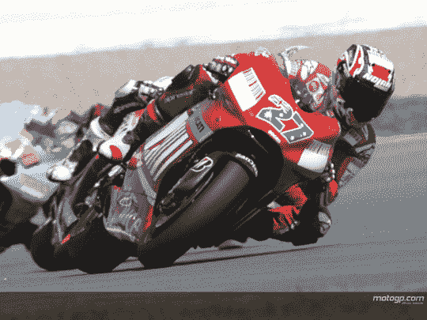
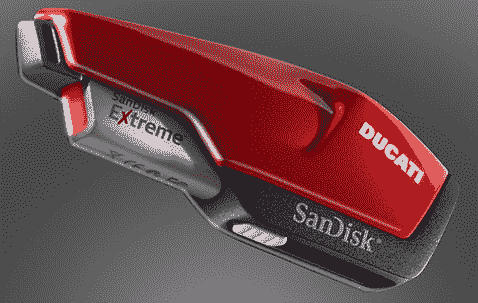
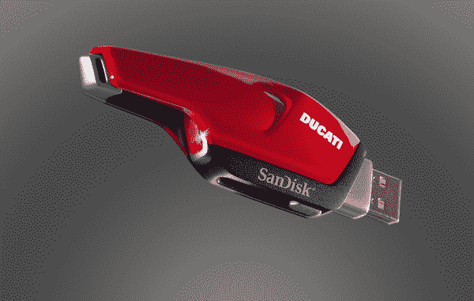
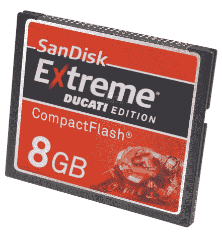
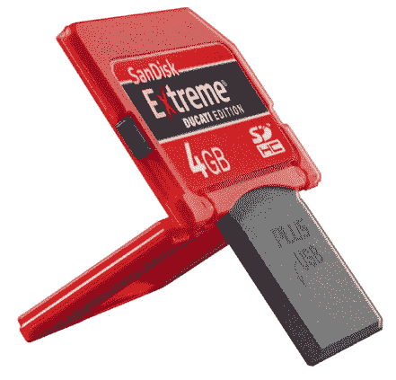

# SanDisk 宣布推出极致杜卡迪版硬盘

> 原文：<https://web.archive.org/web/http://techcrunch.com/2007/07/19/sandisk-announces-extreme-ducati-edition-drives/>

我们通常不会用 USB 闪存驱动器、CF 和 SD 卡来烦你，但是作为我的 [MotoGP](https://web.archive.org/web/20151217035209/http://www.motogp.com/en/motogp/index.htm) 和 [Ducati](https://web.archive.org/web/20151217035209/http://www.ducati.com/en/bikes/my2007/FamilyPage.jhtml?family=Monster) 粉丝，你不得不面对它。作为杜卡迪赛车队的赞助商之一，闪迪在全球舞台上获得了巨大的曝光率，而凯西·斯通纳目前排名第一也没有关系。

首先是极端杜卡迪版 USB 闪存驱动器，它类似于 MotoGP 自行车的后端，带有杜卡迪赛车标志，光滑的红色油漆和黑色装饰。最重要的是，每秒读写 20MB 的 4GB 驱动器有一个红色尾灯，当驱动器被使用时它会亮起。杜卡迪至尊版 drive 将于下月在北美和欧洲上市，售价为 124.99 美元。

接下来是极端杜卡迪版 4GB SD 和 4/8GB CF 卡，它们拥有杜卡迪红色，MotoGP 赛车和杜卡迪 Corse 徽章，将于下个月上市，分别为 164.99 美元，129.99 美元和 314.99 美元。

[闪迪至尊杜卡迪版 u 盘](https://web.archive.org/web/20151217035209/http://www.sandisk.com/Corporate/PressRoom/PressReleases/PressRelease.aspx?ID=3889)

[闪迪至尊杜卡迪版 CF 和 SD Plus 卡](https://web.archive.org/web/20151217035209/http://www.sandisk.com/Corporate/PressRoom/PressReleases/PressRelease.aspx?ID=3886)