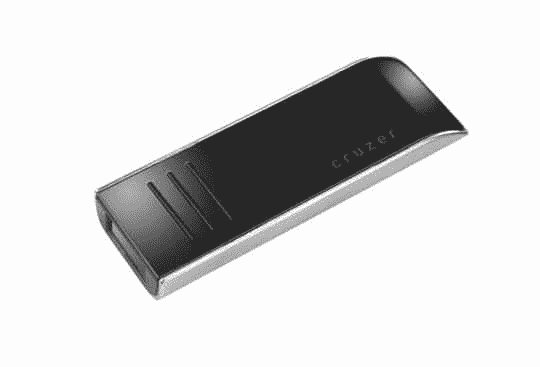
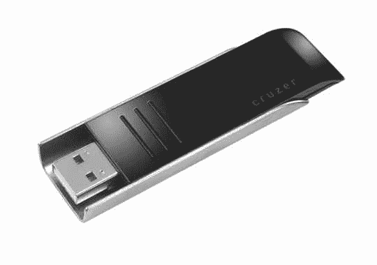
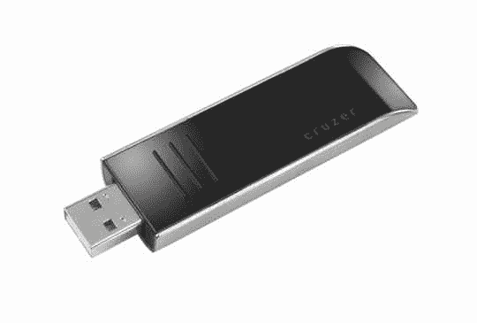

# 闪迪轮廓:形式符合功能？

> 原文：<https://web.archive.org/web/http://techcrunch.com:80/2007/07/20/sandisk-contour-form-meets-function/>

不完全是。虽然 SanDisk Contour 毫无疑问是我见过的最性感的闪存驱动器，但这款设备有一个重大缺陷。

为了追求外观，SanDisk 忽略了在硬盘上安装一个钥匙圈。当然，它包括一个带有环的手提箱，但这并不能真正实现闪存盘的必要功能。

现在我想澄清一下，我并没有完全放弃这个设备。它在所有方面的表现都令人钦佩。传输速度达到标准，U3 接口一如既往地在 PC 上非常有用。

再者，轮廓的卖点，其独特的滑动机制，被敏锐地贯彻。起初感觉有点粗糙，但反复滑动一段时间后，动作变得流畅和有效。

总的来说，我认为这对于那些总是带着包的人来说是可行的，但是对于那些像我一样需要钥匙链上的闪存盘的人来说，有更好的替代产品——其中许多是 SanDisk 的产品。我认为，如果该公司把这一个带回绘图板，并更好地实现其可移植性，那么这个设计可能是伟大的东西。然而，由于它缺乏钥匙链兼容性，我无法给它最好的字节。

SanDisk Contour 现在有 4GB 和 8GB 两种尺寸，售价分别为 100 美元和 190 美元。

[闪迪](https://web.archive.org/web/20141022114319/http://www.sandisk.com/)