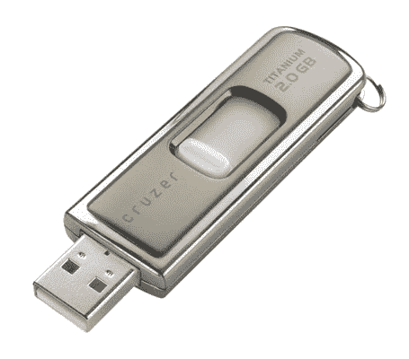

# 战斗测试:SanDisk Cruzer 钛| TechCrunch

> 原文：<https://web.archive.org/web/http://techcrunch.com/2006/09/26/sandisk-cruzer-titanium/>

# 战斗测试:闪迪克鲁泽钛

几年前，我得到了一个 Lexar 2GB 的 u 盘作为圣诞礼物。它装在一个不起眼的小包装里，和其他更值钱的东西放在一起。回想起来，这可能是我收到的最伟大、最有用的礼物之一。这种动力伴随我度过了许多难关，从未失败过。甚至在我丢了它的盖子，担心 USB 插槽会在我的口袋里损坏的时候也没有。它令人钦佩地忍受着，并最终成为我最重要的财产之一。

作为一名大学生，一个适当存储的闪存盘是一个非常宝贵的工具。备份文件，如论文和项目是绝对必要的，固态便携式存储可能是完成这项任务的最佳方式。有一个不可估量的变化的选择，但在收到来自闪迪的 2GB 科鲁兹钛和 4GB 科鲁兹微，真的只有一个选择，我会考虑我的珍贵。

Cruzer Titanium 是迄今为止我用过的最好的闪存盘。它不仅通过 USB 2.0 保持极快的写入速度，其钛外壳看起来也很有吸引力。此外，它可以在被汽车碾压的情况下存活，因此您可以对数据的安全性充满信心。唯一真正的抱怨是，它只有高达 2GB 的容量。所以如果你需要更多的存储空间，我建议你看看 4GB 的科鲁兹微处理器。这是基本相同的驱动器，除了它是在一个典型的塑料外壳。希望 SanDisk 可以激励自己尽快增加钛的产能。

这两种驱动器都支持非常有用的 U3 平台。我使用很多公共终端，我开始想，如果没有它，我该如何生活。U3 允许用户直接从硬盘启动各种程序。我使用了几个来自我旧的 Lexar drive 的程序，但是 U3 使得运行便携软件变得非常容易，特别是对于 Luddites。

也许对我的旧闪存驱动器最有用的发展是这两个 Cruzer 驱动器用来接合 USB 端口的滑动机制。这意味着没有什么好管闲事的上限可以失去。然而，一个问题是 USB 插槽仍然暴露在外。正如我之前提到的，我带着无电容硬盘走了一年多，什么也没发生，但这仍然让我感到尴尬。我想看到一些扣下来保护 USB 的小盖子，但我想这真的没有必要。

总而言之，Cruzer Titanium 是迄今为止我使用过的最好的闪存驱动器，我看不到购买任何其他 2GB 的驱动器。正如我上面提到的，我认为需要另一个驱动器的唯一原因是，如果您的容量需求超过了 Titanium 系列的 2GB 最大值，在这种情况下，您应该考虑提供相同性能的 4GB Cruzer Micro。不然真的没有借口。

[闪迪](https://web.archive.org/web/20131010124708/http://www.sandisk.com/)