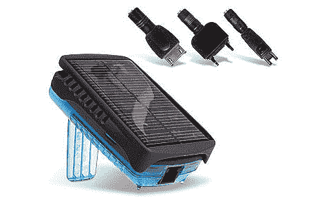

# Scotty Pro 太阳能充电器–TechCrunch

> 原文：<https://web.archive.org/web/http://techcrunch.com/2007/01/22/scotty-pro-solar-power-charger/>

# 斯科特专业太阳能充电器

如果你是那种喜欢偶尔去露营的人，你可能会满足于把你的 iPod 放在家里几天。但不是我。如果我不得不去露营，我会带着我的 iPod、手机、星巴克马克杯、North Face 装备和我的 Wii 一起去野外。所以当我看到相对便宜的 Scotty Pro 充电器时，我开始思考这在远足、户外旅行或类似性质的活动中会有多棒。

花 99 美元，你就可以通过 USB 获得一个太阳能电池板，作为备用充电器/电池。你可以用太阳能给任何东西充电，从你的 iPod 到你的手机到你的拿铁机。从太阳或汽车电源插座给设备充满电需要 7 个小时，但给一些设备供电可以持续 15 个小时。它甚至有可充电的 AA 电池，以防你的设备太“老派”如果我再去露营的话，我可能会买一个。

[Scotty Pro Gadget 充电器](https://web.archive.org/web/20210301021027/http://www.electronista.com/articles/07/01/19/scotty.pro.gadget.charger/)