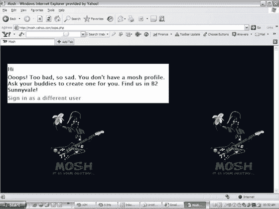
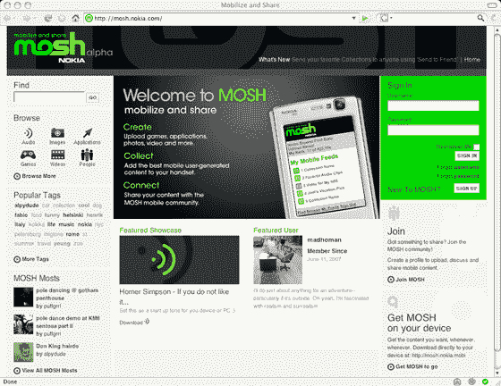

# 雅虎 Mosh 的屏幕截图；此外，诺基亚也有自己的时尚——TechCrunch

> 原文：<https://web.archive.org/web/http://www.techcrunch.com:80/2007/07/09/screen-shot-of-yahoo-mosh-plus-nokia-has-a-mosh-too/>

# 雅虎 Mosh 的屏幕截图；另外，诺基亚也有自己的时尚

更多更新来自我们昨天关于雅虎新社交网络项目 Mosh 的[帖子。一位读者发来了很可能是这项服务的截图。这也可能是一个很容易被快速模仿的赝品，但我不在乎，因为达斯·维德拿着一根香蕉和一把吉他是我觉得必须放在 TechCrunch 上的东西。](https://web.archive.org/web/20220730222602/http://www.beta.techcrunch.com/2007/07/08/mosh-yahoos-new-social-network-initiative/)

如果是真的，我猜 Mosh 小组就在桑尼维尔办公室的 2 号楼。嗨伙计们。

两位读者告诉我们诺基亚 Mosh，这似乎是一个完全独立的产品，与雅虎 Mosh 无关。下面也是它的截屏，密码保护网站的截屏是[这里是](https://web.archive.org/web/20220730222602/http://assemblix.net/flash/nokia-mosh/default.htm)。

谢谢大家的建议。这就是博客的乐趣所在。

