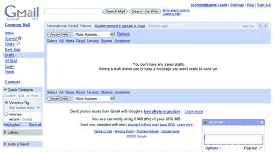
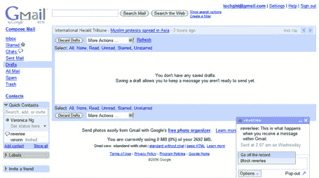
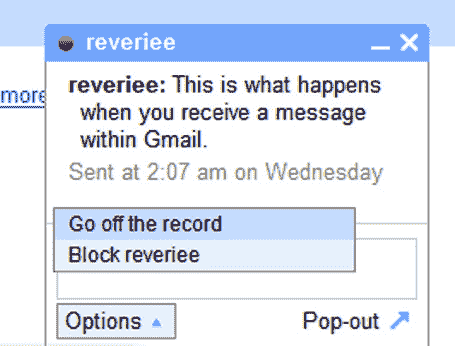
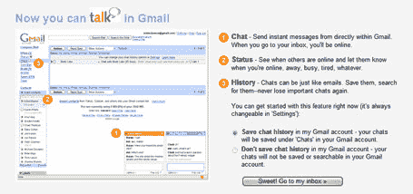

# Gmail 聊天的屏幕截图 TechCrunch

> 原文：<https://web.archive.org/web/http://www.techcrunch.com:80/2006/02/07/screen-shots-of-gmail-chat/>

# Gmail 聊天的屏幕截图

大多数人还没有将 [Gmail 聊天](https://web.archive.org/web/20221206050824/http://www.beta.techcrunch.com/2006/02/06/gmail-chat-to-launch-tomorrow/)内置到 Gmail 中(我没有)。然而，Veronica NG 从她的帐户给我发了一些屏幕截图，我把它们粘贴在下面。

在左下角(管理)和右下角(聊天弹出框)增加了两个界面区域。最后一张图片是第二张图片中聊天框的放大图。

谷歌正在[博客](https://web.archive.org/web/20221206050824/http://googleblog.blogspot.com/2006/02/chat-email-crazy-delicious.html)上介绍该产品。

还有一封来自匿名读者:

