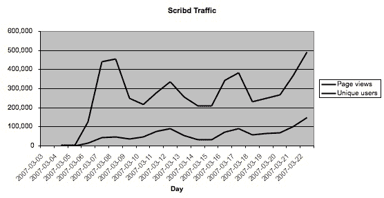

# 现在还为时尚早，但 Scribd 看起来像是赢家 TechCrunch

> 原文：<https://web.archive.org/web/http://www.techcrunch.com:80/2007/03/25/scribd-growing-like-youtube/>

# 现在还很早，但 Scribd 看起来像是一个赢家

两周前，我们报道了“文档的 YouTube”Scribd 的发布。该网站在发布时吸引了大量的流量。然而，与大多数初创公司不同的是，这种流量不会在一两天后就蒸发掉。

每天大约有 100，000 名不同的访问者访问这个网站。12，000 份文件已上传至 8，600 个独立账户(35%匿名)。该团队表示，该网站的流量在美国和非美国访问者之间大致持平(大约一半的文档是非英语)。一个多产的成员， [Builder](https://web.archive.org/web/20230113175919/http://www.scribd.com/people/view/41) (Bill Allin)，他的账户上有 113 个文档。其中之一[“为什么聪明的人往往不快乐”](https://web.archive.org/web/20230113175919/http://www.scribd.com/doc/8778/Why-Intelligent-People-Tend-To-Be-Unhappy)，非常受欢迎，它上了 Digg，并在亚当·卡罗拉的早间节目中被提及。

Scribd 是一个小型创业公司做对很多事情的例子。他们创造了一种天然的病毒产品，并使它非常容易使用。可以匿名发布和查看。更多有趣的文档会被更多的用户投票给顶部以供发现。它似乎对谷歌非常友好——许多文档都在搜索结果中出现。

然而，版权所有者一直在抱怨。迄今为止，已有 25 个 DMCA 网站收到了撤下通知。在每个案例中，文件都被迅速拿了下来，事情友好地结束了。然而，网站上仍然保留着大量受版权保护的材料，Scribd 已经聘请 Wilson sons ini Goodrich & Rosati(YouTube 聘用的同一家公司)就版权问题为他们辩护。与 YouTube 相比，Scribd 更适合处理任何随之而来的投诉。人们电脑上个人写作作品的庞大数量将使人们更容易不依赖非法复制的作品。侵犯版权的基于文本的文档也比丰富的内容更容易被检测到。

Scribd 将发布一些新功能来改善用户体验，包括可调整的嵌入大小、群组和私有文档。

下图显示了 Scribd 自发布以来的内部流量数据。这些内部 Scribd 统计数据相当紧密地跟踪 Alexa 数据。

该公司是由特里普·阿德勒、贾里德·弗里德曼和吉洪·伯恩斯塔姆创建的 T2 公司。