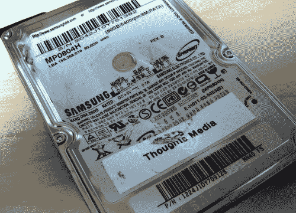

# 希捷停止销售 IDE，也许你会喜欢一点 SATA？

> 原文：<https://web.archive.org/web/http://techcrunch.com:80/2007/07/26/seagate-to-stop-selling-the-ide-maybe-a-little-sata-you-would-like/>

照片经由[贾森·邓恩](https://web.archive.org/web/20150606144137/http://www.jasondunn.com/protecting-data-on-a-hard-drive-the-hammer-way-89)

希捷，我想我的第一个硬盘就是从这家公司买的，将在今年年底停止销售 IDE 驱动器，专注于 SATA。SATA 目前出现在今年售出的超过一半的台式机和 44%的笔记本电脑中。

但是，不要指望 IDE 会步渡渡鸟的后尘。像所有好的标准一样(你最后一次使用串口是什么时候？)，它将在主板上保留多年，成为某种干燥的内部器官。嗯……脱水器官。

[报道:希捷计划在年底停止生产 IDE 驱动器](https://web.archive.org/web/20150606144137/http://arstechnica.com/news.ars/post/20070725-seagate-plans-to-stop-manufacturing-ide-drives-by-the-end-of-2007.html) [Ars]