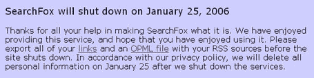

# SearchFox 将关闭 TechCrunch

> 原文：<https://web.archive.org/web/http://www.techcrunch.com:80/2006/01/10/searchfox-to-shut-down/>

Richard Curry 和 Russell Limprecht 几乎同时给我发了邮件，他们注意到拥有一小群忠实用户的 RSS 阅读器 [Searchfox](https://web.archive.org/web/20221002194031/http://rss.searchfox.com/) 在他们的网站上宣布将于 2006 年 1 月 25 日关闭。

我在 2005 年 9 月 12 日的 Searchfox 的原始简介，[在这里](https://web.archive.org/web/20221002194031/http://www.beta.techcrunch.com/2005/09/12/searchfox-personalized-rss-reader/)。一篇后续文章[在这里](https://web.archive.org/web/20221002194031/http://www.beta.techcrunch.com/2005/09/21/searchfox-more-beta-invitations-available/)。

RSS 阅读器领域的竞争越来越激烈，有几十种不同的阅读器可供选择。这个消息传来[新读者推出](https://web.archive.org/web/20221002194031/http://www.beta.techcrunch.com/2005/12/29/dave-winers-newest-adventure/)和其他[宣布资助](https://web.archive.org/web/20221002194031/http://www.beta.techcrunch.com/2005/12/05/attensa-announces-financing/)。