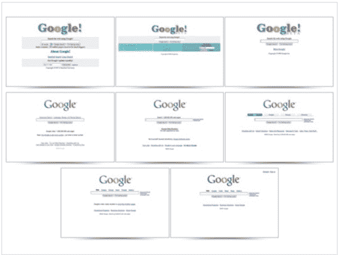
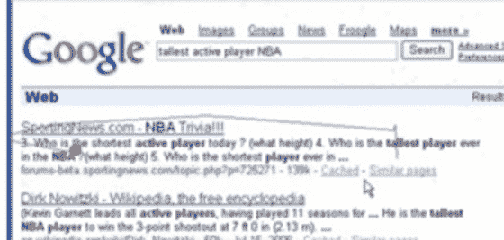
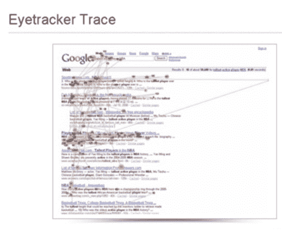
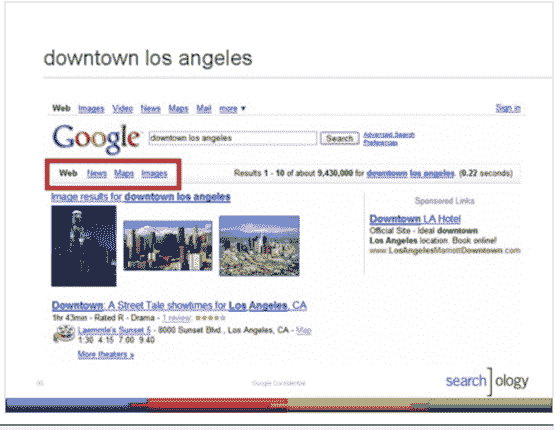
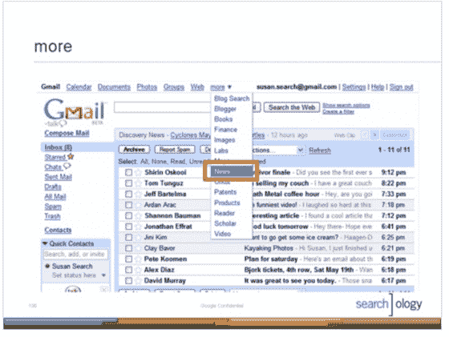

# 今天谷歌的搜索事件:大量公告

> 原文：<https://web.archive.org/web/http://www.techcrunch.com:80/2007/05/16/searchology-event-at-google-today/>

***更新:**在下面的注释部分有几个相当重要的公告。我开始把这些变成帖子了。很多来了。*

今天，至少一半的硅谷科技作家和主要博主来到谷歌总部，参加仅限受邀者参加的 Searchology，在那里我们观看了谷歌高管的一系列演讲。

可能会有也可能没有值得注意的公告——谷歌只是承诺“突出搜索创新的最新消息。”演讲者包括搜索产品和用户体验副总裁 Marissa Mayer 工程副总裁 Udi Manber 和技术总监克雷格·西尔弗斯坦。

议程:

*   欢迎
*   搜索过去的日子(克雷格·西尔弗斯坦)
*   今天我们所知道的搜索(凯瑞·罗登和本·戈麦斯)
*   搜索发展的下一步(Udi Manber，Marissa Mayer)
*   问答环节(乌迪·曼伯、玛丽莎·梅耶、阿兰·尤斯塔斯)

我不知道的是，我可以舒舒服服地躺在床上参加这个活动——整个活动都是流式的，在这里可以看到。

我会用任何有趣的公告更新这个帖子，直到它结束或者我的电池耗尽。

**备注(时间顺序):**

[全球传讯部&公共事务副总裁 Elliot Schrage](https://web.archive.org/web/20211022050432/http://www.google.com/corporate/execs.html#elliot) 欢迎我们，并要求我们关掉手机。在舞台左侧有三个非常大的熔岩灯。

技术总监克雷格·西尔弗斯坦是谷歌继拉里和谢尔盖之后的第三名员工，他目前正在台上讲述谷歌的历史。

银色啤酒杯乐队现在有一张很棒的幻灯片，展示了一段时间以来的谷歌主页:

Ben Gomes(软件工程师)和 Kerry Rodden(高级用户体验研究员)正在谈论搜索的现状。页面排名的概述和定义。

–非常酷的幻灯片显示了可用性研究的结果以及人们在搜索结果页面上的位置。

为下一节课做准备(不得不花点时间写一下企鹅俱乐部，可能错过了一些东西)。

[Udi Manber](https://web.archive.org/web/20211022050432/http://www.google.com/corporate/execs.html#udi) (亚马逊 A9 前 CEO)登场。肯定有什么要宣布的。

udi——“搜索非常非常难”。我们今天将看到的查询中有 20-25%是我们从未见过的。

这是一张很好的幻灯片，展示了简单和困难的查询(从谷歌的角度)以及他们对上下文的永无止境的追求。

udi–**我们将很快推出不同语言的搜索方式，并以不同语言获得搜索结果。谷歌将自动翻译您的查询和结果，以返回更多的结果。**屏幕截图(抱歉质量问题):

 [玛丽莎·梅耶尔](https://web.archive.org/web/20211022050432/http://www.google.com/corporate/execs.html#marissa)现在上台。说他们有几个公告使搜索更直观。

**首先宣布:环球搜索。搜索的整合。书籍，本地，图像，新闻和视频将被整合到主要的谷歌搜索。**

例子:[史蒂夫·乔布斯](https://web.archive.org/web/20211022050432/http://www.google.com/search?q=steve+jobs&start=0&ie=utf-8&oe=utf-8&client=firefox-a&rls=org.mozilla:en-US:official)。图像、新闻、相关等的整合。

[restuarants mounting view California](https://web.archive.org/web/20211022050432/http://www.google.com/search?hl=en&safe=off&client=firefox-a&rls=org.mozilla%3Aen-US%3Aofficial&hs=CT3&q=restaurants+mountain+view+california&btnG=Search)–将 local 整合到主搜索中。叫做环球。
 [纳斯费拉图](https://web.archive.org/web/20211022050432/http://www.google.com/search?hl=en&safe=off&client=firefox-a&rls=org.mozilla:en-US:official&hs=OBO&sa=X&oi=spell&resnum=0&ct=result&cd=1&q=nosferatu&spell=1)——将谷歌视频链接视为第二链接。可以看真正的电影。
 **第二次宣布——谷歌视频搜索现在整合了 youtube 和谷歌视频之外的内容，整合了 metacafe 等其他内容。包括 metacafe 和其他。总共 5 或 6 个。**

[我有一个梦想](https://web.archive.org/web/20211022050432/http://www.google.com/search?hl=en&safe=off&client=firefox-a&rls=org.mozilla%3Aen-US%3Aofficial&hs=hDO&q=i+have+a+dream&btnG=Search)——将视频直接整合到搜索结果中(嵌入)

[另一个视频例子](https://web.archive.org/web/20211022050432/http://www.google.com/search?hl=en&safe=off&client=firefox-a&rls=org.mozilla%3Aen-US%3Aofficial&hs=LFO&q=things+you+can%27t+do+when+you%27re+not+in+a+pool&btnG=Search)。

maris sa——有些人仍然希望在视频或新闻等垂直领域进行搜索。谷歌在搜索结果的正上方添加链接到有相关结果(博客、书籍、群组、代码等)的垂直引擎。)

 **下一个公告:谷歌通用导航条:**横跨所有谷歌属性的导航条。到达 gmail 等。随时只需点击一下。

**接下来:[谷歌实验](https://web.archive.org/web/20211022050432/http://www.google.com/experimental/index.html)。google.com/experimental.可以在谷歌上看到所有最新的实验。注册任何一个，它都会增加你默认的谷歌搜索体验。**

时间轴视图。地图视图。直接集成到搜索中。更多–参见实验现场。

去 QA。谢尔盖·布林也加入了