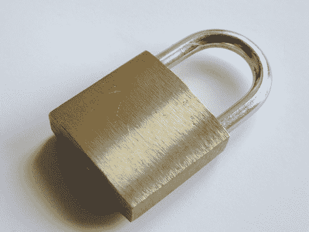

# 保护你的 iPhone 流量，以免黑客窃取你的信息

> 原文：<https://web.archive.org/web/http://techcrunch.com/2007/07/18/secure-your-iphones-traffic-lest-hackerz-steal-your-info/>

每个酷的人都有一部 iPhone*，但有一个小问题是，你所有的数据都漂浮在空中，等待脚本小子去嗅。(我曾经在校园里巡游寻找密码。他们很幸运，我只是做了，因为我可以，而不是把信息卖给一些第三世界的疯子。)Macworld 为你所有的 iPhone 安全需求列出了一个全面的注意事项。所有这一切都源于手机内置的 Wi-Fi:它不在乎连接是否安全，所以它会不管三七二十一就跳过去，将你和你的敏感信息置于危险之中。

总之，你需要给 iPhone 配备尽可能多的安全软件，使用尽可能多的安全协议。你可能会认为这是常识，但并不是每个购买了 iPhone 的人都能编写自己的脚本来搜索网络寻找后门。去吧，摇滚一个 VPN 始终坚持使用 SSL 的域；使用荷兰的加密代理。如果你不这样做，你可能会发现你所有的信息最终都会被 Craigslist 收录。

*拥有一部 iPhone 不会让你变得很酷

[保护你的 iPhone 流量](https://web.archive.org/web/20160119111806/http://www.macworld.com/2007/07/features/iphone_security/index.php?lsrc=mwrss)【苹果世界】