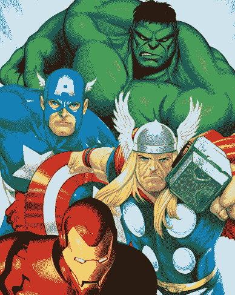

# SEGA 和漫威带来了超级 B 队——TechCrunch

> 原文：<https://web.archive.org/web/http://techcrunch.com/2007/04/18/sega-and-marvel-bring-out-the-super-b-team/>

# SEGA 和漫威带来了超级 B 队

当你想到一个超级英雄的时候？蝙蝠侠，蜘蛛侠，超人，绿巨人…还有，是的，那个戴着面具和服装的家伙！在 x 战警和前面提到的英雄之后，拥挤的犯罪战士世界真的只是一群喜欢打扮和与同样奇怪的反派战斗的公子哥儿。

但是如果你真的喜欢《美国队长》、《雷神》和《钢铁侠》这样的游戏，那你很幸运，因为 SEGA 和漫威娱乐已经合作为这些人(还有绿巨人)创作了原创游戏。虽然称这些家伙为“B 队”可能不太公平，但是他们到底有什么特别之处呢？美国队长不是应该死了吗？考虑到许多英雄游戏已经远离超级也无济于事。有人记得神奇四侠吗？那些可怕的蝙蝠侠游戏呢？现在超级反派游戏听起来更吸引人！