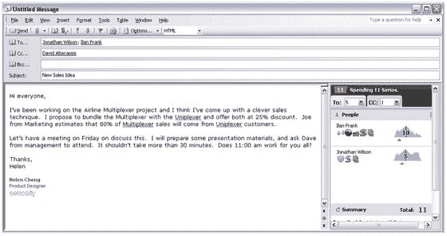

# 认真解决(或不解决)电子邮件超载问题

> 原文：<https://web.archive.org/web/http://www.techcrunch.com:80/2007/02/28/seriosity-to-fix-email-overload-or-not/>

# 认真修复电子邮件超载(或没有)

  [严重程度](https://web.archive.org/web/20220129041027/http://www.seriosity.com/)有一个解决电子邮件收件箱过度拥挤的方案。如果你想引起某人的注意，你会为此付出代价的。

该公司的吸引力在于，他们研究了《魔兽世界》和其他多人游戏，并相信他们已经找到了吸引人们注意力的正确方式——虚拟货币。你把一笔付款附在一封叫做 Serio 的电子邮件上，然后转给收件人。收件人能够根据支付金额的大小来确定电子邮件的重要性。当收件箱爆满时，读者大概会选择收入较高的邮件。

这让我强烈地想起了 beenz，一种 Web 1.0 货币，它可以用来做各种事情，比如访问网站，否则用户不会费心去做这些事情。就在本世纪早些时候纳斯达克暴跌之后，这家公司就分崩离析了。

不清楚的是，除了发送电子邮件，人们还能拿这种货币做什么。让我把它转换成现金或者飞行里程或者别的什么，我就加入了(beenz 就是这么做的)。否则，除了收集大量的 Serio，然后花在发送电子邮件上，还有什么意义呢？

该公司成立于 2004 年，总部设在帕洛阿尔托，正在用 600 万美元的风险投资养活 27 名饥饿的员工。更多信息见 [CNET](https://web.archive.org/web/20220129041027/http://news.com.com/2100-1038_3-6162798.html) 。

