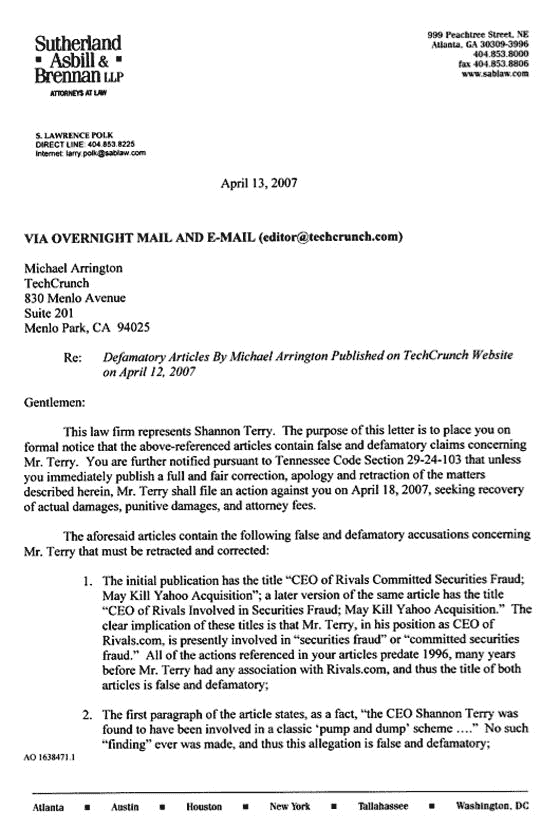
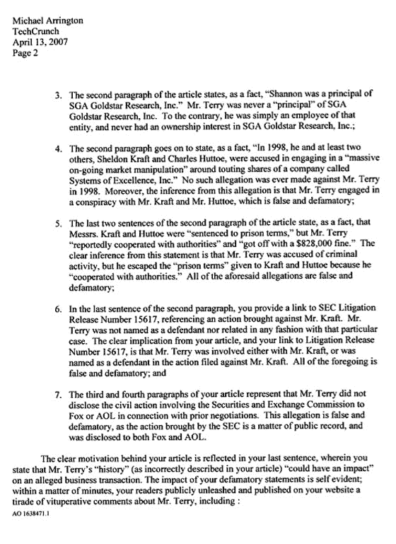

# 香农·特里很生气，威胁要起诉 

> 原文：<https://web.archive.org/web/http://www.techcrunch.com:80/2007/04/13/shannon-terry-is-pissed-off-threatens-lawsuit-against-techcrunch/>

# 香农·特里很生气，威胁要起诉 

我刚刚通过电子邮件收到了下面这封信，关于我之前关于香农·特里和 Rivals.com 的文章。我还不打算就此发表声明——我们的律师已经介入，并建议我暂时保持沉默。

不过，我要说的是。对手不再是我最喜欢的体育新闻网站。

***更新(太平洋标准时间 4/13/08 晚上 11:42):**我仍然不准备直接回复下面的信。然而，我确实想直接联系 Shannon Terry，并说:我给你机会以书面形式回应我最初的帖子，并反驳帖子中陈述的任何事实或观点。我将在 TechCrunch 上发表你未经编辑的回复，给予它与原始帖子完全平等的宣传。事实上，我会把它放在第一页的最上面整整 24 小时，你可以选择你希望它出版的日子。它将永久保留在 TechCrunch 上，并将有一个独特的网址。它可以是您认为合适的任何长度，并且您可以链接到您喜欢的任何支持文档。*

