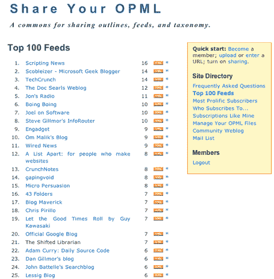

# 分享您的 OPML 

> 原文：<https://web.archive.org/web/http://www.techcrunch.com/2006/05/07/share-your-opml/>

  [分享你的 OPML](https://web.archive.org/web/20230219182552/http://share.opml.org/) ，一个由[戴夫·温纳](https://web.archive.org/web/20230219182552/http://www.scripting.com/)创立的新项目，将于周一正式启动。它自称是“共享概要、提要和分类法的公共资源”它将收集一个订阅列表社区，并以有趣和有用的方式将它们聚合起来。

若要参与，请创建一个帐户并上传一个包含您阅读的内容源的 OPML 文件。大多数 feed 阅读器如 Bloglines、NewsGator、罗约、Attensa 等。以 OPML 文件格式存储您阅读的提要，并可以导出。您的 OPML 文件中包含的提要与其他人上传的提要聚合在一起。如果你不知道这些东西意味着什么，不要担心。你仍然可以通过这个网站找到你可能喜欢阅读的新内容。

这些汇总数据非常有用。特别是，它将帮助人们找到他们可能喜欢的新提要。

有一个最受欢迎的提要的[前 100 名列表](https://web.archive.org/web/20230219182552/http://share.opml.org/rankings/)，一旦有统计相关的用户数量(取决于 SYO 成功控制垃圾邮件)，它可能会成为最终的前 100 名列表。你也可以看到和你有相似阅读习惯的其他用户(这叫做“像我一样订阅”)。基于这最后一个特征，[约翰·特罗佩亚](https://web.archive.org/web/20230219182552/http://share.opml.org/viewsharedfeeds/?user_id=29)、[罗伯特·斯考伯](https://web.archive.org/web/20230219182552/http://share.opml.org/viewsharedfeeds/?user_id=22)和[戴夫·维纳](https://web.archive.org/web/20230219182552/http://share.opml.org/viewsharedfeeds/?user_id=3)是我最接近的匹配者。通过仔细阅读他们的列表，我可能会找到其他有趣的提要。

现在包括了基本的共享选项:用户可以将共享设置为关闭，这将保持他或她的列表的私密性(但仍将这些订阅源包括在总排名中)。Dave Winer 说，他们将在几天内开启每订阅源共享。

垃圾邮件可能会成为该网站的一个问题，因为人们试图游戏的前 100 名名单。现在有一些控制措施——一个 feed 只计算一次，即使它多次出现在 OPML 文件中，而且一个电子邮件地址只能创建一个帐户。Dave 在运行 Weblogs.com ping 服务器的时候有很多处理垃圾邮件的经验，所以随着服务的发展，会有更多的保护措施出台。

如果添加了工具，使 SYO 成为管理您的 OPML 最简单的地方(包括添加提要、删除提要、批处理操作、分类/标记等)。)，一些更开明的 RSS 阅读器可能会开始允许客户在 SYO 存储他们的 OPML，而不是与阅读器一起。SYO 将成为人们 OPML 档案的一种中央登记处。

