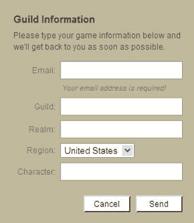

# 肖恩·范宁的新社交网络将遵循 WoW TechCrunch

> 原文：<https://web.archive.org/web/http://www.techcrunch.com/2006/12/01/shawn-fannings-new-social-network-will-comply-with-wow/>

# 肖恩·范宁的新社交网络将遵从 WoW

肖恩·范宁的一名代表今天致电 TechCrunch，明确表示这位 Napster 创始人计划于明年推出的社交网站将确实符合《魔兽世界》的使用条款。

商业周刊[报道](https://web.archive.org/web/20221003202424/http://www.businessweek.com/the_thread/blogspotting/archives/2006/12/shawn_fanning_t.html?campaign_id=rss_blog_blogspotting)称， [Napster](https://web.archive.org/web/20221003202424/http://www.beta.techcrunch.com/tag/Napster/) 和 [Snocap](https://web.archive.org/web/20221003202424/http://www.beta.techcrunch.com/2005/06/14/snocap-launches-digital-music-registry/) 的创始人范宁正在开发一个名为[破裂](https://web.archive.org/web/20221003202424/http://rupture.com/)的新社交网站。该网站将有一个 WoW 插件，以便玩家可以直接从游戏中的破裂网络。

早期关于这个主题的博客推测破裂可能“与魔兽争霸的使用条款相冲突”范宁的代表坚持认为情况并非如此，破裂是“绝对符合魔兽世界。”

据报道，破裂将允许除 WoW 之外的其他游戏的社交网络。

我们要求采访范宁，但他不会接受采访，直到网站推出，他的代表只能说，将在明年上半年。现在，网站的访问者可以通过提供他们的电子邮件、公会和领域来请求额外的信息。范宁告诉《商业周刊》,他从包括罗恩·康韦和 Joi Ito 在内的一群投资者那里为该网站筹集了资金。

