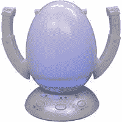

# Shoe Pure 100 看起来像恐龙蛋

> 原文：<https://web.archive.org/web/http://techcrunch.com:80/2007/07/26/shoe-pure-100-looks-like-an-dinosaur-egg/>

我不想撒谎。我有 20 多双鞋，其中大约 7 双真的很臭。有的比有的差，都是我的错。在那些炎热的夏天，当我半醉的时候，我没穿袜子就穿上鞋，5 个小时后，它闻起来就像腐烂的奶酪。如果我有一双纯 100 的鞋子，第二天我的鞋子会闻起来像玫瑰。

这个蛋形的装置在使用时会发出美丽的蓝色光，也是一个很好的装饰品。它的工作原理是用热空气吹干你的鞋子，同时也能消毒。毕竟，那股难闻的气味*是由细菌引起的*。易于使用，该设备只需要 30 分钟就可以让你的踢腿焕然一新。售价约 68 美元，在日本有售。

[Shoe Pure 100——来自日本的发光蛋形鞋子脱水机](https://web.archive.org/web/20150525232723/http://www.newlaunches.com/archives/shoe_pure_100_a_glowing_egg_shaped_shoe_dehydrator_from_japan.php)【新品发布】