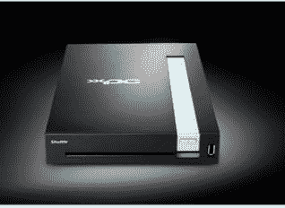

# 航天飞机发射 X100 

> 原文：<https://web.archive.org/web/http://techcrunch.com:80/2006/08/14/shuttle-launches-x100/>

穿梭 XPC 系统公司宣布推出 X100，这是其小型塔式机系列的最新成员。像航天飞机的其他装备一样，X100 在一个令人印象深刻的小盒子里提供了可观的性能。X100 采用 1.6Ghz、1.83Ghz 或 2.0Ghz 的英特尔酷睿双核处理器。该机还配备了高达 2GB 的 DDR2 533 内存和 250GB 的 7200RPM SATA 硬盘。在多媒体方面，ATI Mobility 镭龙 X1400 芯片组提供图形，而 Realtek ALC880 音频编解码器提供高清声音。

X100 的尺寸为 8.26 英寸(长)x 11.65 英寸(宽)x 2.16 英寸(高)，似乎是 mac mini 的合法竞争对手。X100 现已上市，价格为 999 美元起，打折前 100 美元。

XPC 航天飞机系统公司 X100