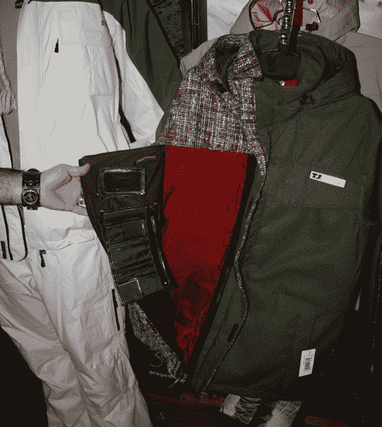

# SIA 夏日雪景 2007:Orage-TechCrunch 手把手

> 原文：<https://web.archive.org/web/http://techcrunch.com/2007/07/11/sia-summer-snowdown-2007-hands-on-with-orage/>

# SIA 夏日雪景 2007:牵手奥兰治

我花了几分钟和 Orage 的人交谈，我很高兴我这样做了。加拿大滑雪装备出来的装备是尖端和时尚的。车队车手 TJ Schiller 的定制夹克装饰有一些简洁的功能，让你可以隐藏你的货物，而不是拖着一个包或出租一个储物柜。前面的拉链有足够的空间放你需要随身携带的任何东西。光是设计就让它从人群中脱颖而出，half-tweed 是非常摇滚的明星，我喜欢它。Orage 的所有夹克都带有你已经习惯的其他滑雪夹克的标准功能，如雪裙，防水和完全透气，但 Orage 有一些你可能喜欢的小技巧，在其他地方找不到。

你在这里看到的是典型的 Orage 夹克，因为它们有内部的带子，所以如果你太热了，你可以在夹克周围“背包”。他们也有可以塞进夹克里面的全面罩，以防天气变坏，你需要保护你的脸免受风灼伤等等。另一个我喜欢的小功能是顶部按钮用磁铁代替了按钮。我不知道我为什么喜欢它，但我喜欢，所以处理它。:)

[Orage](https://web.archive.org/web/20200805203653/http://www.orageski.com/en/)