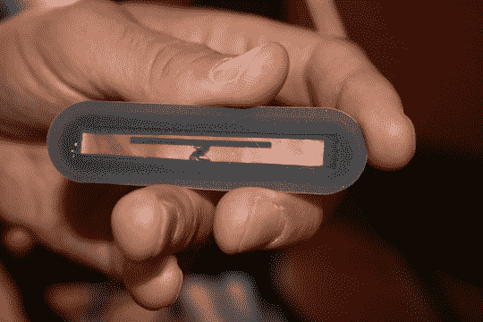
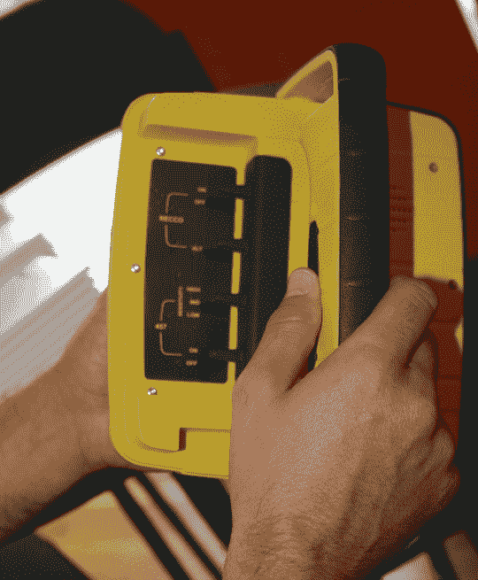
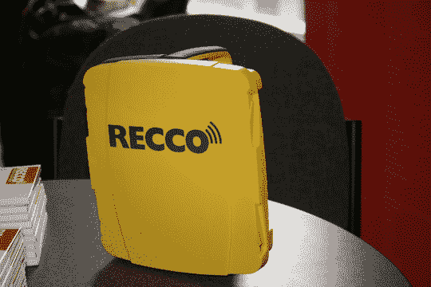
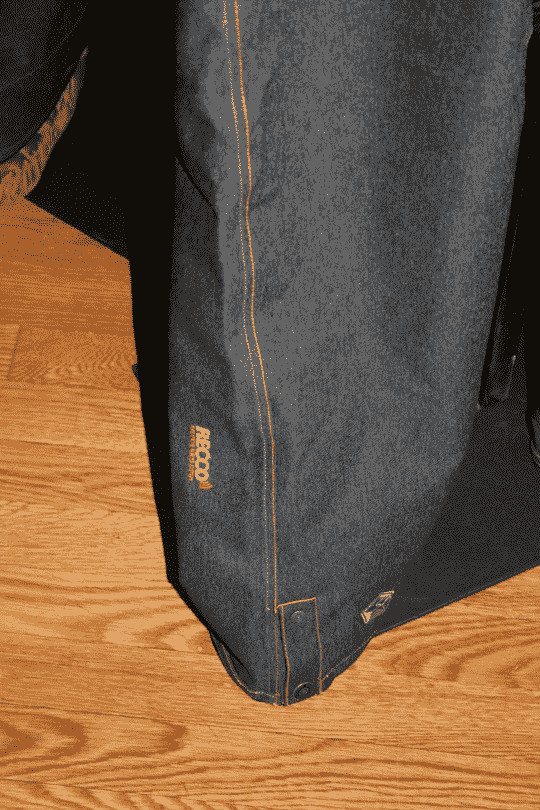

# SIA 夏日斯诺登 2007: RECCO，雪崩救援系统

> 原文：<https://web.archive.org/web/http://techcrunch.com:80/2007/07/11/sia-summer-snowdown-2007-recco-avalanche-rescue-system/>

RECCO 是一个雪崩救援系统，被全世界 500 多个救援组织使用。上图中的 RECCO 反射器完全集成到最新的雪地/滑雪装备中，如果不幸被困在雪崩中，你会很快获救。RECCO 系统在探测器和反射器之间使用了谐波雷达，它可以让你快速定位 200 米内的受害者。雪地作业深度为 20 米。虽然它不会取代收发器，但它可以作为一种补充搜索工具，因此救援人员可以更快地找到你。几十名志愿者寻找受害者的工作可能需要几个小时，但一个人使用 RECCO 系统可以在大约 20 分钟内找到你。RECCO 可以在你最喜欢的冬季装备制造商中找到，如所罗门、奥克利、The North Face、Rip Curl、Helly Hansen、耐克 ACG、Vans、Quiksilver、 [Sessions](https://web.archive.org/web/20151102211955/http://crunchgear.com/2007/07/11/sia-summer-snowdown-2007-a-quick-session-with-sessions/) 等等。

RECCO 集成到一双[会话的裤腿](https://web.archive.org/web/20151102211955/http://crunchgear.com/2007/07/11/sia-summer-snowdown-2007-a-quick-session-with-sessions/)滑雪板裤

[RECCO](https://web.archive.org/web/20151102211955/http://www.recco.com/startsida/index.asp)