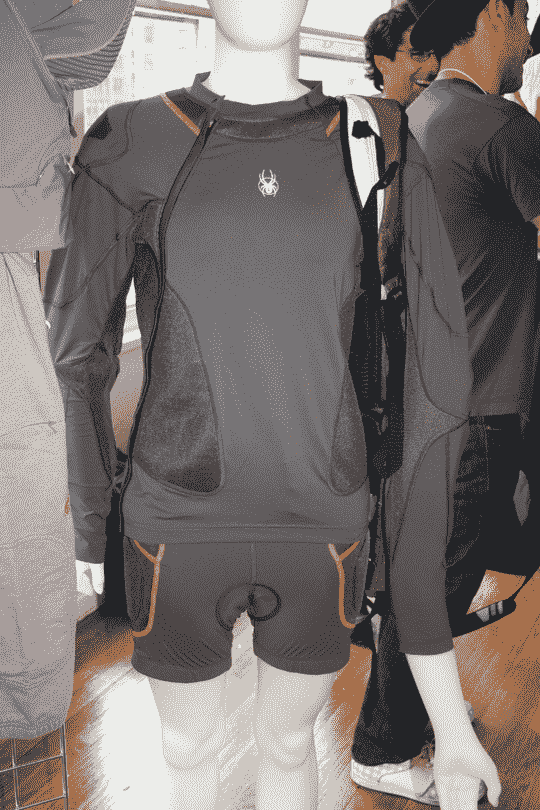

# SIA 夏日斯诺登 2007:斯派德的液体装甲服

> 原文：<https://web.archive.org/web/http://techcrunch.com/2007/07/11/sia-summer-snowdown-2007-spyders-liquid-armor-suit/>

 [https://web.archive.org/web/20151102233426if_/http://www.youtube.com/embed/Grq2NzI9nNI?version=3&rel=1&fs=1&showsearch=0&showinfo=1&iv_load_policy=1&wmode=transparent](https://web.archive.org/web/20151102233426if_/http://www.youtube.com/embed/Grq2NzI9nNI?version=3&rel=1&fs=1&showsearch=0&showinfo=1&iv_load_policy=1&wmode=transparent)

视频

像往常一样，Spyder 展出了一些非常邪恶的东西，但我被 [d3o](https://web.archive.org/web/20151102233426/http://www.d3o.com/) “液体盔甲”套装吸引住了。我知道这项技术并不新，但看到它被集成到表演服装中仍然很酷，比如女士 d3o Freeryde 装甲服，跳跃后的图片。如果你是一名赛车手，那么 d3o 套装可以在你冲过大门时保护你的前臂免受严重的擦伤。见鬼，任何人都可以在日常生活中使用一点 d3o。这东西简直太棒了。

[Spyder](https://web.archive.org/web/20151102233426/http://www.spyder.com/home.asp)