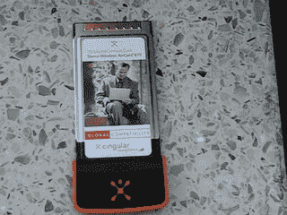

# 塞拉无线宣布 AirCard 875 | TechCrunch

> 原文：<https://web.archive.org/web/http://techcrunch.com/2006/09/13/sierra-wireless-announces-aircard-875-2/>

# 塞拉无线宣布购买 AirCard 875

在 CTIA，Sierra Wireless 和 Cingular Wireless 宣布他们将发布 AirCard 875。AirCard 875 是一款 3G LaptopConnect 卡，也是美国第一款 HSDPA 3.6 Mbps 网卡。新的 AirCard 将允许 Cingular 的客户在 100 多个国家拥有移动宽带连接。当 Cingular 客户签署一份为期两年的无限制数据连接合同(59 美元)时，该卡的零售价为 99.99 美元(折扣后)。如果你总是忙碌的话，这笔交易还不错。

塞拉无线还宣布了