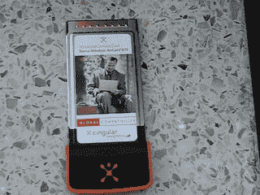

# Sierra Wireless 发布 AirCard 875

> 原文：<https://web.archive.org/web/http://techcrunch.com/2006/09/13/sierra-wireless-announces-aircard-875/>

# 塞拉无线宣布 AirCard 875

在 CTIA，Sierra Wireless 和 Cingular Wireless 宣布将发布 AirCard 875。AirCard 875 是一款 3G 笔记本连接卡，也是美国第一款 HSDPA 3.6 Mbps 网卡。新的 AirCard 将允许 Cingular 的客户在 100 多个国家拥有移动宽带连接。当 Cingular 的客户签署两年无限制数据连接合同(59.00 美元)时，该卡的零售价格将为 99.99 美元(折扣后)。如果你总是忙碌的话，这是一笔不错的交易。

Sierra Wireless 还公布了 USB NC5725 Rev A 嵌入式模块。这款 USB 调制解调器支持 EV-DO Rev A，并且带有一个坞站，如果您的所有 USB 插头都已装满，可以使用该坞站将调制解调器插入您的桌面。

