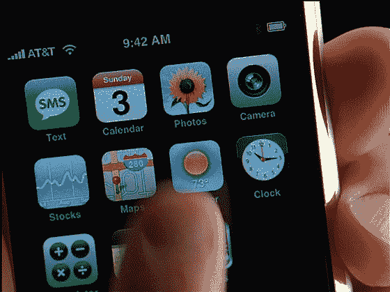

# iPhone 遇到麻烦的迹象

> 原文：<https://web.archive.org/web/http://www.techcrunch.com:80/2007/06/07/signs-of-trouble-for-the-iphone/>

# iPhone 有麻烦的迹象

[CrunchGear](https://web.archive.org/web/20220819182619/http://crunchgear.com/2007/06/07/the-futurist-we-predict-the-iphone-will-bomb/) 写了一些关于即将推出的 iPhone 的令人不安的迹象，同一天《商业周刊》称它可能成为苹果公司的[100 亿美元](https://web.archive.org/web/20220819182619/http://www.businessweek.com/technology/content/jun2007/tc20070606_154290.htm)的业务。例如，发布日期是 6 月的最后一个工作日，这表明苹果确实需要更多时间，但担心错过 6 月发布日期的[后果](https://web.archive.org/web/20220819182619/http://www.beta.techcrunch.com/2007/05/16/engadget-knocks-4-billion-of-apple-market-cap-on-bogus-iphone-email/)。另一个问题是:iPhone 的玻璃屏幕很容易破碎。触摸屏键盘上有更多功能。

在这一点上，我站在苹果一边。CrunchGear 只是在传播对这一革命性新产品的恐惧、不确定性和怀疑。[点击这里](https://web.archive.org/web/20220819182619/http://www.beta.techcrunch.com/tag/iphone)查看我们所有的 iPhone 报道。