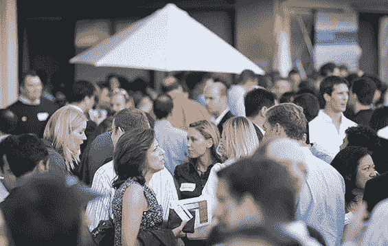

# 硅谷现在可以利用经济低迷期

> 原文：<https://web.archive.org/web/http://www.techcrunch.com:80/2007/05/22/silicon-valley-could-use-a-downturn-right-about-now/>

硅谷是极客的天堂，人们从世界各地聚集到这里来参与一些非常特别的事情。当我在这里的活动上发言时，我经常做的一件事是请住在硅谷的观众举手。通常 80%以上的人会举手。然后我请他们如果真的是在这里出生的话，请举手。只有少数人还举着手——生活在这里、从事科技工作的绝大多数人都是在职业生涯的某个阶段搬到这里的。这是一个巧妙的客厅把戏，但它显示了这个地方是多么的特别。我们在硅谷的整个文化都是以技术和企业家精神为基础的，所有的人才都是从世界各地引进的。你是什么肤色，你崇拜什么神，你选择和谁睡觉，都无关紧要。重要的是制造的产品和产品背后的技术。

硅谷在某些时候会很有趣。当我在 2005 年开始写 TechCrunch 时，情况就是这样。也有一些小的收购(Flickr 等)。)，但在大多数情况下，没有太多的风险资本进入新的网络创业公司，IPO 窗口被牢牢关闭，上市公司也没有进行太多的并购。尽管有几十家新的创业公司，但参与其中的人大多都在这里，因为他们喜欢他们所做的事情。没有人有营销部门或公关公司。奢华的发布会是 90 年代末的模糊记忆。

事件也开始涌现。我们的第一次聚会是在 2005 年 9 月。大约 20 名企业家来我家喝啤酒，吃汉堡。YouTube 的联合创始人查德·赫利是与会者之一。我记得我问他是否认为整个 YouTube 的事情会成功。

我们很快又有了三个类似的(但是有更多的人)。当我回头看那些早期事件的[图片](https://web.archive.org/web/20221205025011/http://www.beta.techcrunch.com/2005/10/22/thank-you-for-coming-to-our-party/) [时，我记得美好的时光，没有人谈论 2000 万美元的风险投资或以 16.5 亿美元的价格出售。像 Meebo 和 Sphere 这样的公司是在我的客厅里，在几百个真正感兴趣的人面前推出的。](https://web.archive.org/web/20221205025011/http://laughingsquid.com/techcrunch-meetup-3-photos/)

在那里的某个地方，钱开始滚滚而来。我们的第一笔收入是在 2005 年 12 月。几个月后，许多公司每轮融资 300 万美元，收购 YouTube 后每轮融资 700 万美元。公司开始雇佣营销经理和公关公司，并在发布会上花费数万美元。现在，在疯狂开始一年后，情况更加糟糕。公司不得不主动避开风险投资者，以避免筹集一大笔资金。

时代很好，钱在流，硅谷很烂。

我不知道这是什么，但同样的事情发生在泡沫破裂前的九十年代末。许多初创公司得到了毫无意义的资助，但人们还是很兴奋。在第一轮令人瞠目结舌的巨额投资之前，一个独特、美丽且执行良好的想法并不值得一提。人们变得更加焦虑，更有可能因愤怒或嫉妒而对某人破口大骂。谣言传播激增，一个至关重要的平衡失去了。它不再是关于漂亮的产品和天才的开发者。这是关于金钱和地位，以及热门公关小妞和营销部门。

事情的新闻面也同样疯狂。我没有在第一次泡沫中写博客，所以我不能把现在和那时相比。但是企业家不再只是为了获得我们的意见和希望一篇博客文章和一点讨论而与我们交谈。这些人需要压力才能从众多像他们一样的创业公司中脱颖而出。拒绝他们并不是一个真正的选择。他们带着一瓶酒或花出现在我们的前门。他们指示他们的公关公司做任何必要的事情来获得一个故事。不止一次，当我们说我们不报道他们时，我的首席执行官在电话中崩溃并哭泣。在那些谈话之后，我不止一次地收起并写下了他们。

上一次我离开硅谷时，正值疯狂的高峰期，当我在 2005 年回来时，我惊喜地看到围绕创新的如此多的善意和社区。现在，就像过去一样，硅谷不再有趣。事实上，情况变得非常糟糕。我们中的一些人可能是时候离开一段时间，再次从外面观看疯狂。再过几年，事情又会美好起来。巨额资金将会沉睡，营销部门将会成为遥远的记忆。我们可以再次关注技术。汉堡和啤酒。