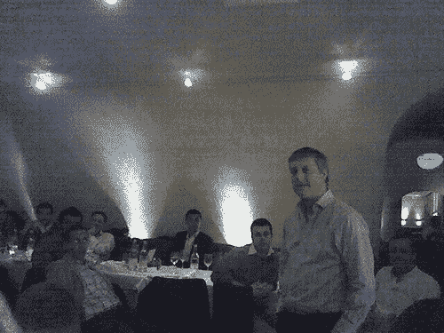

# 西蒙·默多克在互联网人晚宴上发言

> 原文：<https://web.archive.org/web/http://techcrunch.com/2006/11/09/simon-murdoch-speaks-at-internet-people-dinner/>

[西蒙·默多克](https://web.archive.org/web/20150806233608/http://www.e-consultancy.com/internetdecade/m/simon-murdoch-16.html)有意思。亚马逊在英国的第一任掌门人既是企业家又是风险投资家，现在他又回来做企业家了。

昨晚，他在一个由企业家组成的[互联网人](https://web.archive.org/web/20150806233608/http://www.internetpeeps.com/)晚宴上发表演讲(通过举手示意)，简短地讲述了网络创业的经历以及如何筹集资金。以下是他演讲期间的转述笔记。

默多克于 1996 年建立了 Bookpages.co.uk 在线书店，并于 1996 年 4 月将其出售给英国的亚马逊。从那时起，他成为 Amazon.com 欧洲副总裁，后来从 1998 年 10 月到 1999 年管理该公司。之后，他成为 Episode 1 Partners 的联合创始人和合伙人，这是一家早期技术投资公司，管理着 2000 年 1 月成立的 1 亿美元的 Chase Episode 1 基金。

Chase Capital Partners 投资了九项业务，尤其是成功的 Betfair.com[和](https://web.archive.org/web/20150806233608/http://betfair.com/)。作为天使投资人，他投资了 [Shazam](https://web.archive.org/web/20150806233608/http://www.shazam.com/) ，与西蒙·卡尔弗(Simon Calver)一起担任[视频岛](https://web.archive.org/web/20150806233608/http://videoisland.com/)(现已与 [LoveFilm](https://web.archive.org/web/20150806233608/http://www.lovefilm.com/) 合并并更名为[love film](https://web.archive.org/web/20150806233608/http://www.lovefilm.com/))的董事长，后者现在得到了[基准资本](https://web.archive.org/web/20150806233608/http://www.benchmark.com/)的支持。

目前，他创建并资助了 FriendsAbroad.com，这是一个发展语言技能和海外关系的社交网络。

为亚马逊工作是一次“大开眼界的经历”，他从中了解到，美国企业“从一开始就具有全球视野”——这是我们在英国往往忽视的一点。

他认为天使投资“相当具有挑战性”，但借用胖子斯利姆的话来说，他认为此时此地是成为一名互联网企业家的绝佳时机

永恒的问题:你如何筹集资金？他发现，大多数企业家都想吹嘘自己的估值。一个更好的主意是找出你的目标是什么。迈克·索森的《[啤酒企业家](https://web.archive.org/web/20150806233608/http://www.amazon.co.uk/Beermat-Entrepreneur-Really-Great-Business/dp/0273659294)》一书中提到了这一点，你也应该找到一种不需要任何启动资金的方法。让客户先找到市场在哪里——现在社交网络在这里，这很方便。

当你最终筹到钱的时候，你会失去一些控制，所以要处理好这个问题。一旦你有了投资者，你就会追随他们的目标，而不是你的。

请注意，风投只对规模庞大的企业感兴趣——他们不关心一年能赚 200-300 万英镑的小生意。它需要在它的市场上有一两个。

任何初创公司最初的风险都是‘你的技术行得通吗’——这是风投希望看到的。你需要证明你想要的东西有市场。“不要被[点击芒果](https://web.archive.org/web/20150806233608/http://news.zdnet.co.uk/internet/0,1000000097,2075043,00.htm)”

“风投喜欢有‘B 想法’的‘A 团队’，而不是有‘A 想法’的 B 团队。”

例如，“ [Bebo](https://web.archive.org/web/20150806233608/http://www.bebo.com/) 是一家已经证明了技术的公司，有一个伟大的团队，和大量的流量，但他们真的不知道钱在哪里，但希望 Benchmark 能帮助他们找到这一点。”

“创业最重要的一点是不要耗尽现金。千万不要那样做。”(因此，不要一开始就花钱)。

也要意识到风投从来不会说不。“死亡是被风投千刀万剐。”他们会问你无数个问题。为什么？如果你像你说的那样好，你会有更好的主意。不要因为与风投的“第三次会面”而激动。毫无意义。

因此，你可以花很多时间为风投服务。最好专注于业务。最好是在风投们吵着要投资的情况下。

默多克还承认，风投通常不会告诉你你的合伙人是“废物”，以防他们破釜沉舟。

为什么这么多风投都是一哄而起，经常投资同一类公司？当你有很多其他聪明人的时候，在合伙关系中很难成为一个自信的风投。

除非在特殊情况下，如果你不需要，不要从风投那里融资，因为它会束缚你在其他交易上的手脚。

即使你不需要钱，让他们参与进来也是一个好主意，因为他们会让你争取更高的赌注。