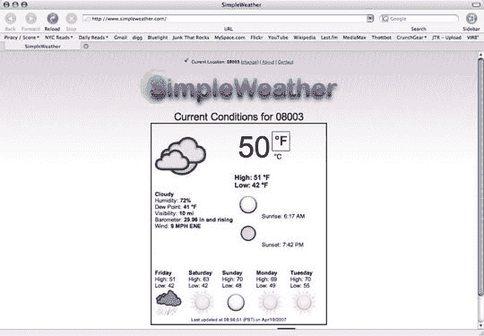

# 简单天气跳过杂乱——TechCrunch

> 原文：<https://web.archive.org/web/http://www.techcrunch.com:80/2007/04/19/simpleweather-skips-the-clutter/>

# 简单天气跳过杂波

《克朗彻奇》的作者之一文斯·维内齐亚尼和几个朋友一起创作了《SimpleWeather.com》。它几乎是一个网络小工具——去网站上看看天气，没有大惊小怪，没有混乱，没有阿扎尔式的混乱。它是免费的，而且显然没有广告，目前正在美国运行，欧洲和加拿大的版本即将推出。看看这个。

[SimpleWeather.com](https://web.archive.org/web/20210302052109/http://www.simpleweather.com/)