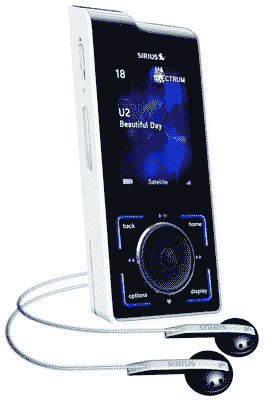

# Sirius Stiletto 100 来了…惊喜| TechCrunch

> 原文：<https://web.archive.org/web/http://techcrunch.com:80/2006/09/26/sirius-stiletto-100-is-coming-surprise/>

天狼星今天正式宣布高跟鞋 100 便携式卫星广播。这对任何人来说都不应该感到惊讶，因为我们已经对高跟鞋 100 进行了几个月的报道，但官方媒体的确认标志着该产品即将发布。Sirius 表示，Stiletto 100 将于本月上市，建议零售价为 349.99 美元。也有套件可用，使该单位可以同步与汽车或家庭音响。

除了可以播放卫星广播之外，Stiletto 100 还是一款非常不错的 DAP。它包括一个 2GB 的硬盘驱动器，因此用户除了收听甜美的卫星广播外，还可以上传一些专辑。该系统将利用雅虎！满足 MP3 需求的音乐点唱机。它还配有 WiFi，可以播放 Sirius 的新网络电台。这绝对是我的下一个 DAP。

[天狼星](https://web.archive.org/web/20141012114225/http://www.sirius.com/)