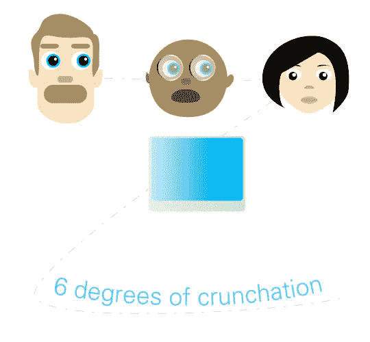

# 六度嘎吱嘎吱大赛:还剩一小时

> 原文：<https://web.archive.org/web/http://techcrunch.com:80/2006/08/31/six-degrees-of-crunchation-contest-an-hour-left/>

# 六度仰卧起坐比赛:还剩一小时

好的。关键时刻到了。我们将在太平洋标准时间中午 12 点结束比赛，目前我们只有一个参赛作品。如果我参加这个比赛，我肯定会喜欢这些赔率-这意味着一个人，从现在开始，将同时获得一台 Moto Q 和一台 Kodak v603…除非我开始看到一些参赛作品！请继续阅读完整的规则。

> 这是一个复杂的问题，但这是一对伟大的奖项，所以请原谅我。
> 这是我们 8 月份的最后一场比赛，包括创建用户链。待价而沽的是一台摩托罗拉 Q 和一台柯达 Easyshare V603。下面是怎么玩的…
> 
> 我们需要你告诉一个朋友拿着你的名字拍一张照片。然后那个人会告诉另一个人举着你的名字照张相，等等。链条最长的参赛者将赢得 Q，照片最酷的参赛者将赢得柯达。所谓酷，我们指的是可能是一个名人，或者可能是一些女性，这样我就不用在 500 张照片中搜寻那些从他们的隔间里扔出令人震惊的东西的人了。
> 
> 例句:乔·史密斯让无名氏给她拍照。她举着一块牌子，上面写着乔·史密斯。然后无名氏告诉莎莉·威尔森举着乔·史密斯的名字给自己照张相，诸如此类。把詹姆斯·伍兹或米莎·巴顿放进去，你就赢得了柯达。我是认真的。
> 
> 把这些照片放在一封厚厚的电子邮件中，以“6 度”为主题发送到 gmail dot com 的 crunchgear。截止日期是太平洋标准时间 8 月 31 日下周四中午。这是两个很棒的奖项，参赛作品非常少，所以只需一点点努力，你就可能得到一些主要的技术设备。
> 
> 把这些照片放在一封厚厚的电子邮件中，以“6 度”为主题发送到 gmail dot com 的 crunchgear。截止日期是太平洋标准时间 8 月 31 日下周四中午。这是两个很棒的奖项，参赛作品非常少，所以只需一点点努力，你就可能得到一些主要的技术设备。
> 
> 特别感谢[柯达](https://web.archive.org/web/20130627212047/http://www.kodak.com/)和[摩托罗拉](https://web.archive.org/web/20130627212047/http://www.motorola.com/)提供奖品。