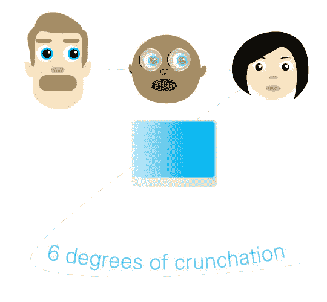

# 六度嘎吱嘎吱竞赛

> 原文：<https://web.archive.org/web/http://techcrunch.com/2006/08/24/six-degrees-of-crunchation-contest/>

这是一个复杂的问题，但这是一对伟大的奖项，所以请原谅我。
这是我们八月份的最后一场比赛，包括创建用户链。待价而沽的是一辆[摩托罗拉 Q](https://web.archive.org/web/20150929072951/http://www.motorola.com/motoinfo/product/details/0,,113,00.html) 和一辆[柯达 Easyshare V603](https://web.archive.org/web/20150929072951/http://www.kodak.com/eknec/PageQuerier.jhtml?pq-path=8803&pq-locale=en_US) 。下面是如何玩…

我们需要你告诉一个朋友拿着你的名字在纸上拍一张照片。然后那个人会告诉另一个人举着你的名字照张相，等等。链条最长的参赛者将赢得 Q，照片最酷的参赛者将赢得柯达。所谓酷，我们指的是可能是一个名人或者可能是一些女性，这样我就不用在 500 张男人从他们的小隔间扔出令人震惊的照片中搜寻了。

例句:乔·史密斯让无名氏给她拍照。她举着一块牌子，上面写着乔·史密斯。然后无名氏告诉莎莉·威尔森举着乔·史密斯的名字给自己照张相，诸如此类。把[詹姆斯·伍兹](https://web.archive.org/web/20150929072951/http://www.hilary.com/images/jameswoods6.jpg)或[米莎·巴顿](www.mischa-b.com/)放进去，你就赢得了柯达。我是认真的。

把这些照片放在一封厚厚的电子邮件中，以“6 度”为主题发送到 gmail dot com 的 crunchgear。截止日期是太平洋标准时间 8 月 31 日下周四中午。这是两个很棒的奖项，参赛作品非常少，所以只需一点点努力，你就可能得到一些主要的技术设备。

特别感谢[柯达](https://web.archive.org/web/20150929072951/http://www.kodak.com/)和[摩托罗拉](https://web.archive.org/web/20150929072951/http://www.motorola.com/)提供奖品。