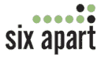

# SixApart 进军商业领域

> 原文：<https://web.archive.org/web/http://www.techcrunch.com:80/2006/03/07/sixapart-moves-into-business-space/>

热门博客平台 [TypePad](https://web.archive.org/web/20160309180920/http://www.typepad.com/) 和 [MovableType](https://web.archive.org/web/20160309180920/http://www.movabletype.com/) 的创建者 [SixApart](https://web.archive.org/web/20160309180920/http://www.sixapart.com/) 将为他们的产品发布一系列新功能和服务，直接针对博客软件不断增长的商业市场。目前，已经有大量的公司使用 SixApart 软件发布博客，最新版本是更好地支持和扩大企业客户群的更广泛战略的一部分。

新战略的第一个软件版本将是 Typepad Business Class，这是一个新的 Typepad 版本，适用于拥有高流量网站的公司，这些公司希望建立一个或多个博客来与他们的受众交流。TypePad Business Class 将于今天发布，将包含针对企业需求而定制的对经典 TypePad 的多项技术增强。对于初学者来说，将有一个改进的权限结构，最多有 4 个级别的管理员访问权限，可用于控制对博客所有方面的访问(如发布能力，评论管理，设计编辑)。他们也使得建立额外的博客和控制公司博客设计的所有方面变得容易，这样它可以被定制以匹配他们的公司身份。企业级服务的存储分配将为 4GB，而带宽分配将为每月 40GB，价格为每月 89.95 美元。具有更多存储和带宽分配的其他计划也将以更高的价格提供。

SixApart 还将伴随着服务水平协议的技术改进，这将保证一定水平的正常运行时间，如果他们希望将大公司吸引到他们的平台上，这是一个必不可少的要求。提供的 SLA 只能保证 99%的正常运行时间(每年仍有 4 天的停机时间，这是没有保证的)，但这是第一个来自博客提供商的此类保证。SixApart 还将举办研讨会帮助公司开始写博客，第一次是 2006 年 3 月 16 日在洛杉矶举行的博客商业峰会。

此外，作为新业务战略的一部分，MovableType 将通过一些企业功能进行改造，如与 LDAP 目录和其他认证服务的集成、更好的反垃圾邮件保护、Oracle 数据库支持(以及其他)和可定制的电子邮件支持。商业级 MovableType 还没有发布日期或价格，但它目前在日本处于测试阶段，应该很快就会推出。

似乎每天你都会听到或看到又一家公司开了博客的消息，所以用目标产品抓住这种兴趣和增长是 SixApart 的一个非常聪明的策略。目前，这些希望写博客的企业要么自己建立博客，要么聘请外部顾问，所以现在他们有了一家在消费者领域拥有稳固市场份额和良好声誉的公司。我相信 WordPress 和其他公司抓住这个市场并发布他们自己的商业服务只是时间问题。