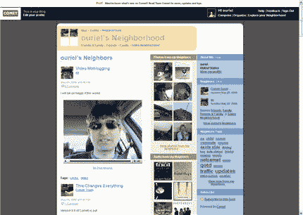

# SixApart 将于 6 月 1 日推出 Comet，更名为 Vox 

> 原文：<https://web.archive.org/web/http://www.techcrunch.com:80/2006/05/31/sixapart-to-launch-comet-renamed-vox-on-june-1/>

# SixApart 将于 6 月 1 日发射彗星，改名为 Vox

  总部位于旧金山的 [SixApart](https://web.archive.org/web/20221205091125/http://www.sixapart.com/) ，拥有 Typepad、MovableType 和 LiveJournal 博客平台，将于 6 月 1 日星期四开始让用户测试他们新的 [Vox(以前的 Comet)](https://web.archive.org/web/20221205091125/http://www.notcomet.com/) 托管博客平台。最初会有几千人被允许进入，然后他们会逐渐增加。

Vox 最初是在去年秋天的一次演示会议上推出的([单击此处](https://web.archive.org/web/20221205091125/http://www.demo.com/demonstrators/demo2005fall/55065.html)了解详情和 Mena Trott 演示的视频档案)。

Vox 是一个面向新手的博客平台(尽管具有丰富而深刻的功能)，也是一个社交网络。“新帖子”功能是所见即所得，允许非常容易地从亚马逊上传图像、音频和视频，以及书籍信息(供评论)。可以为每个帖子设置隐私设置，以及描述性标签。

社交网络是一个明显的焦点。一个名为“邻居”的朋友列表被醒目地显示在每个页面上(见下面的截图)。如果你想把名单上的任何人添加为好友，只需将鼠标悬停在他们的照片上，就会弹出许多选项。

对于那些想要完全控制网站外观和感觉的硬核博主来说，Vox 目前还不是一个平台。但是它结合了一个伟大的界面和大多数人真正想要的功能——与 Flickr 和 YouTube 的集成，简单的书评等等。这是直接针对 MSN 空间和 AIM 页面。

Vox 将是免费的，并支持广告。

更多截图[这里](https://web.archive.org/web/20221205091125/http://www.flickr.com/photos/ouriel/tags/comet/)。

