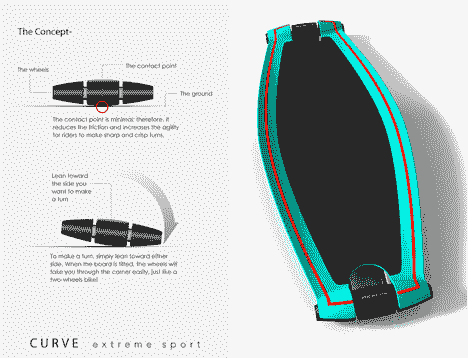
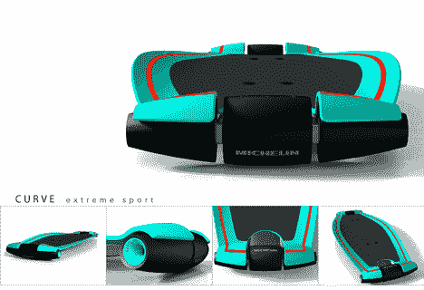
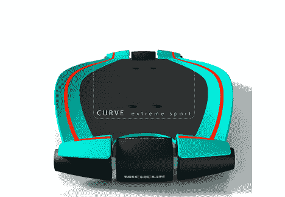

# 像 MotoGP 赛车一样玩滑板

> 原文：<https://web.archive.org/web/http://techcrunch.com/2007/07/19/skateboard-like-a-motogp-racer/>

Garry Chang 的最新作品是一个滑板，奇怪的是它让我想起了摩托车。啊？什么？！Curve Extreme Sport 抛弃了两个轮子，采用了更具流线型的方法，由于两个轮子位于前后的中央，因此允许溜冰者以更高的速度轮流滑行。车轮基本上是边缘逐渐变细的摩托车/自行车轮胎，这样你就可以比通常四个轮子更积极地转弯。我现在就想要这个。

[弯道滑板](https://web.archive.org/web/20140215174522/http://www.yankodesign.com/index.php/2007/07/19/skateboard-on-a-curve/)【Yanko 设计】