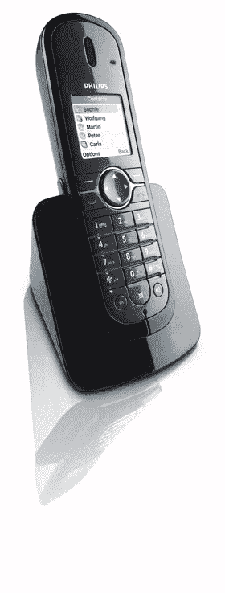

# Skype 和飞利浦开始忙碌，放弃电脑

> 原文：<https://web.archive.org/web/http://techcrunch.com:80/2006/08/31/skype-and-philips-get-busy-ditch-computer/>

飞利浦今天上午宣布其产品线中增加了 Skype 认证的 VOIP841。我们已经看到了一些新的 Skype 设备，但是它们的重要性现在才变得明显。

就像我们昨天看到的 USRobotics USR963 1 一样，VOIP841 可以完全独立于计算机运行。用户可以直接从手机上注册 Skype 服务，这意味着它甚至不需要电脑进行设置。

与目前可用的支持 WiFi 的 Skype 电话不同，VOIP841 在 1.8GHz DECT 频率上工作，信号非常可靠。该手机可以连接到您的 Skype 帐户和现有的座机。如果用户增加一部附加手机，该系统就能同时接收 Skype 和座机的通话。

我想这些对打大量国际电话的用户来说可能非常有用，但对基本用户来说似乎不太划算。扣除宽带费用和 Skype 进出费用后，这项服务的费用至少和普通服务一样多。我相信它会非常好用，我真的很钦佩 Skype 在网络电话方面取得的进步。这些下一代 Skype 手机将于今年假期上市。

[Skype](https://web.archive.org/web/20150323052018/http://www.skype.com/)