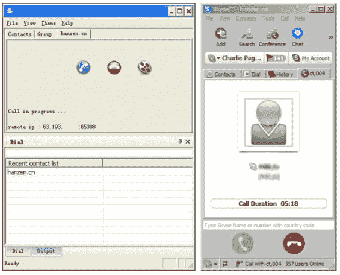

# Skype 协议被黑

> 原文：<https://web.archive.org/web/http://www.techcrunch.com:80/2006/07/14/skype-protocol-hacked/>

来自亚洲的报道称 Skype 协议被黑客攻击。如果准确的话，这意味着用户无需使用 Skype 客户端就可以访问 Skype VOIP 网络——可以通过第三方软件直接与 Skype 用户通话。一款兼容 Skype 的客户端将于 7 月底上市。

这些报道还暗示，新软件将不支持 Skype 的超级节点架构，这意味着用户不会有运行 Skype 时经常出现的资源消耗问题。虽然这对黑客的用户来说很好，但它可能会破坏整个 Skype 网络的稳定，或者至少会降低速度。

今天晚上，我和 Skype 发言人谈了这件事。她的评论是“我们还没有时间来评估或确认这个故事，所以还没有任何评论。”他们的直觉会告诉他们采取法律行动(这可能不会有任何效果，因为声称这样做的公司是在中国)。但是他们[应该做的是](https://web.archive.org/web/20220706100047/http://saunderslog.com/2006/07/13/skype-cracked/)利用这个机会开放协议，允许第三方开发者开发兼容 Skype 的应用程序(根据 Skype 的条款)。

**更新:** Skype PR 在太平洋标准时间 2006 年 7 月 14 日上午 11 点发给我以下声明:

> Skype 知道一小群中国工程师声称他们对 Skype 软件进行了逆向工程。我们没有证据表明这是真的。即使有可能做到这一点，软件代码也将缺乏 Skype 的功能集和可靠性，而 Skype 目前拥有超过 1 亿用户。此外，再多的逆向工程也不会威胁到 Skype 的加密安全性或完整性

第三方客户的屏幕截图:

