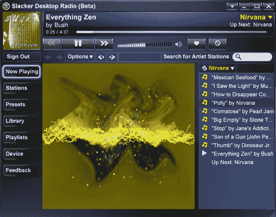

# 懒虫现在就在你的桌面上

> 原文：<https://web.archive.org/web/http://www.techcrunch.com:80/2007/05/29/slacker-now-on-your-desktop/>

 社交音乐领域雄心勃勃的新进者之一，[懒鬼](https://web.archive.org/web/20160416114541/http://www.techcrunch.com/2007/03/14/new-music-service-slacker-has-very-broad-ambitions/)发布了他们三部曲音乐个性化套件的第二部，一款桌面音乐播放器。

Slacker 的播放器分享了很多 [MyStrands](https://web.archive.org/web/20160416114541/http://www.techcrunch.com/2007/03/14/mystrands-mobile-adds-community-to-streaming-audio/) 和 [Last.fm](https://web.archive.org/web/20160416114541/http://www.techcrunch.com/2006/11/01/lastfm-relaunches-with-new-features/) 的核心功能。用户通过在播放器中输入关键字来创建个性化的广播流。没有倒带，无法播放特定的歌曲。用户根据个人音乐偏好训练播放器，投票支持或反对播放的曲目。每首歌都有专辑封面和乐队简介，但是 Slacker 缺少个人和乐队的维基页面，而用户在其他服务上已经被吸引了。

与 Last.fm、 [iLike](https://web.archive.org/web/20160416114541/http://www.techcrunch.com/2007/02/27/ilike-growing-quickly-still-massively-trailing-lastfm/) 和 [MOG](https://web.archive.org/web/20160416114541/http://www.techcrunch.com/2007/01/19/mog-launches-embeddable-mp3-player/) 不同，Slacker 不会跟踪你在 iTunes 中播放的音乐。相反，懒鬼功能作为一个独立的播放器，管理个人音乐库，并提供很酷的音乐可视化。

iTunes 集成的缺乏可能是由于 Slacker 自己的便携式音乐播放器的预期发布，该播放器将与桌面播放器集成。用户将能够从他们的桌面向他们的便携式播放器推送歌曲、播放列表和偏好。最终,“懒虫”的三个部分将同步工作，每个部分都根据你的最新偏好更新其他部分。

