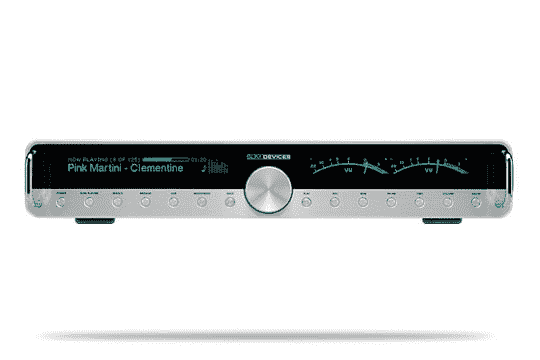

# 超薄设备/罗技传送器播放美妙的音乐

> 原文：<https://web.archive.org/web/http://techcrunch.com/2007/06/14/slim-deviceslogitech-transporter-streams-beautiful-music/>

那些想在数字音频流媒体设备上花一大笔钱的人应该看看罗技新推出的 Transporter 网络音乐播放器。据说这种长设备可以从几乎任何来源传递高保真质量的声音。将一个以太网插孔连接到传送器上，你就可以从家里的任何一台 Mac 或 PC 上播放音乐了。

得益于传送器的多种模拟和数字输入和输出，您可以通过多种方式输出您的音乐。总的来说，它看起来像你典型的超薄设备设计，并且可能像该公司过去制造的设备一样工作良好。太糟糕了，它的价格高达 1999.99 美元，绝对没有人会花那么多钱买罗技品牌的产品。

[产品页面](https://web.archive.org/web/20151020091149/http://www.logitech.com/index.cfm/speakers_audio/wireless_music_systems/devices/3163&cl=us,en)