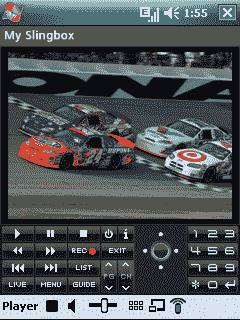

# Sling 为 WM6  发布 SlingPlayer 移动版

> 原文：<https://web.archive.org/web/http://techcrunch.com/2007/06/21/sling-releases-slingplayer-mobile-for-wm6/>

只是一个快速的头向任何人与一个新的宏达触摸也许和弹弓。Sling Media 发布了流行的 SlingPlayer 的新 Windows Mobile 6 版本。你现在可以在公共汽车上、火车上或者在邻居的毒窝里看你最喜欢的当地电视节目。很可爱。

升级到 WM6 版本需要 30 美元，但如果你已经使用 WM5 版本有一段时间了，这是免费的。

[Sling 拆包 WM6 的 Sling player Mobile](https://web.archive.org/web/20141011110216/http://www.electronista.com/articles/07/06/21/slingplayer.mobile.wm6/)