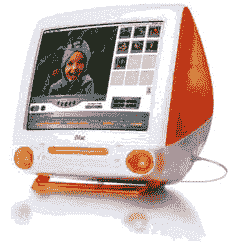

# 插槽加载 iMac 月 18 日告别| TechCrunch

> 原文：<https://web.archive.org/web/http://techcrunch.com/2007/07/30/slot-loading-imac-says-goodbye-on-september-18/>

到了 9 月 18 日，我们都会穿着黑色的衣服，哀悼老虎机 iMac 的死亡(或者庆祝它的诞生)。是的，把 USB 带给大众，把 Mac OS 带回我们心中的电脑在那个决定性的星期二寿终正寝。一旦达到 18，苹果将不再向维修中心提供该型号 iMac 的维修零件或文档。

现在我们是悲伤的小丑。

我们将要告别的 iMacs 列表？

> iMac 350 MHz
> iMac 400 MHz DV
> iMac 400 MHz DV(特别版)
> Apple Cinema Display(1999-2000)
> Apple Studio Display 15 英寸 DVI
> Apple Studio Display 21
> Airport 基站(石墨)

有没有人有特别感人的 iMac 故事？我第一次接触苹果电脑是在高中。后来我得到了这个作为生日礼物，从那以后我就再也没有用过 Windows 盒子。当然，一开始弄清楚为什么点击应用程序窗口上的“+”按钮不会导致它全屏显示是一件很麻烦的事情，但是我找到了窍门。唷！

[装载 iMac 的插槽直到 9 月 18 日](https://web.archive.org/web/20140122121000/http://www.macmerc.com/news/archives/4084)【MacMerc.com】才正式过时